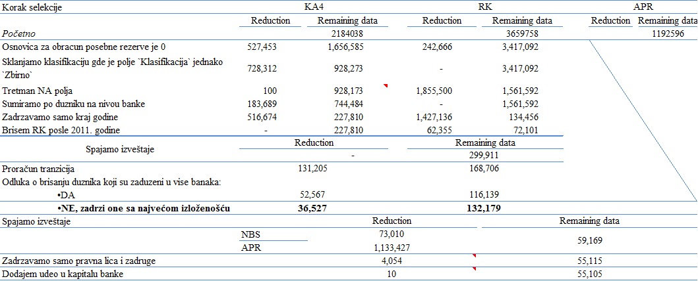

<body style="font-family:times;text-align:justify" >
## 1. Ucitavanje podataka APR-a  

Ucitacemo dva csv fajla, jedan sadrzi starije datume do 2013. godine dok drugi sadrzi novije datume od 2014. godine pa na dalje. Uvezivanje AOP-a po novom i starom kontnom okviru je vec uradjeno i sacuvano u data dva csv fajla. Sami fajlovi ne sadrze AOP-e!!! Razlog je što ne bi mogli da se spoje u jedan fajl budući da AOP-i  po starom i novom kontnom okviru nisu mapirani jedana na jedan i samim tim ne bi mogli da se "nalepe" jedan na drugi u cilju dobijanja jednog `data.frame`-a jer bi imali razlicit broj AOP-a (citaj kolona), fajlovi medjutim sadrze proracunata finansijska racija. Fajlovi sadrze finansijska racija koja su sracunata iz premapiranih iz AOP-a dva kontna okvira (novi i stari kontni okvir). Za detaljniji pregled, uvid u pojedinacne AOP-e pogledati fajlove iz foldera ove analize, fajlovi ce se nalaziti u <font color="red">"~\\Early warning\\Bottom Up\\Korak 3\\Pokazatelji"</font> gde  ~ predstavlja adresu na kojoj je postavljen folder.  
Dodatno pojasnjenje o toliko spominjanim AOP-ima:

<p style="margin-left: 40px;margin-right: 40px;text-align:justify;color:gray">
U APR bazi su sve pozicije iz bilansa stanja, bilansa uspeha, tokova gotovine, statistickih podataka o preduzecu (statisticki aneks) tretirane kao AOP pozicije, tako na primer broj zaposlenih datog preduzeca mozemo naci u polju AOP 605 za taj maticni broj, ili na primer vrednost stalne imovine iz bilansa stanja se nalazi u polju AOP 001. Medjutim usled menjanja kontnog okvira novi AOP-i sada imaju 4  umesto 3 cifre tako da gore navedane dve varijable se sada nalaze pod AOP-ima 9005 i 0002 respektivno. Medjutim nemoguce je premapirati sve AOP-e po starom nacinu izvestavanja sa AOP-ima po novom nacinu izvestavanja jedan na jedan pa je samim tim bilo i nemoguce prikazati tabela sa varijablama koje ucestvuju u proracunu finansijskih racija, vec su samo prikazani finansijski raciji kao krajnji rezultat.
</p>

Cilj je spojiti ova dva csv fajla u jedan. Ucitamo finansijska racija do 2013. godine:
```{r,eval=FALSE, message=FALSE, warning=FALSE, include=FALSE}
#generalne opcije i ucitavanje potrebnih biblioteka
if(require('readr')==F){install.packages('readr');require('readr')}
if(require("data.table",quietly = F) ==F){install.packages("data.table");require("data.table",quietly = F)}
if(require('DT')==F){install.packages('DT');require('DT')}
if(require('e1071')==F){install.packages('e1071');require('e1071')}
if(require('rpivotTable')==F){install.packages('rpivotTable');require('rpivotTable')}
if(require('cowplot')==F){install.packages('cowplot');require('cowplot')}
if(require('plotROC')==F){install.packages('plotROC');require('plotROC')}
if(require('pROC')==F){install.packages('pROC');require('pROC')}
if(require("InformationValue")==F){install.packages("InformationValue");require("InformationValue")}
if(require("Information")==F){install.packages("Information");require("Information")}
if(require("gtools")==F){install.packages("gtools");require("gtools")}
if(require("forecast")==F){install.packages("forecast");require("forecast")}

```  

```{r}
Pokazatelji_stari <- read_delim("C:/Users/milos.cipovic/Desktop/Projekti/Early warning/Razvojni folder/Bottom Up/Korak 3/Pokazatelji/Pokazatelji stari.csv",";", escape_double = FALSE, col_types = cols(Datum = col_date(format = "%m-%d-%Y")), locale = locale(encoding = "ASCII"), trim_ws = TRUE, progress =FALSE)
gc()
```

Ucitamo finansijska racija posle 2013. godine
```{r, eval=FALSE}
Pokazatelji_novi <-
  read_delim(
  "C:/Users/milos.cipovic/Desktop/Projekti/Early warning/Razvojni folder/Bottom Up/Korak 3/Pokazatelji/Pokazatelji novi.csv",
  ";",
  escape_double = FALSE,
  col_types = cols(Datum = col_date(format = "%m-%d-%Y")),
  locale = locale(encoding = "ASCII"),
  trim_ws = TRUE,
  progress = FALSE
  )
  gc()
```

Spajamo tabele `Pokazatelji_stari` i `Pokazatelji_novi` u jednu tabelu, ove dve tabele su ustvari predstavljale proracunata finansijska racija.  Tabele su dobijene prethodnom analitikom i obradom podataka u excelu jer nije bilo moguce drugacije.. Pokrećemo `read_KA4_RK_data` funkciju za pripremanje KA4 i RK izvestaja. Kreiranje `NBS_data` funkcije je vec ranije opisano u scriptu <font color="red">'~\\Early warning\\Bottom Up\\Korak 4\\Early warning\\nbs_data_prep.R'</font> koji sadrzi sustinski isti kod koji i funkcija `read_KA4_RK_data`.
```{r,message=FALSE,warning=FALSE,eval=FALSE}
APR_data <- rbind.data.frame(Pokazatelji_stari, Pokazatelji_novi)
rm(Pokazatelji_stari , Pokazatelji_novi)
gc()


source("nbs_data_prep_function.R")
KA4_url = "C:/Users/milos.cipovic/Desktop/Baze podataka/K4 i APR i NPL/KA4_podaci.txt"
RK_url = "C:/Users/milos.cipovic/Desktop/Baze podataka/K4 i APR i NPL/RK_novi.txt"
NBS_data <- read_KA4_RK_data(KA4_url, RK_url)

```

Spajamo APR i NBS podatke i izbacujemo kolonu `NazivSektor` jer pravi probleme pri eksportu. Postoji sifrovana verzija ove kolone tako da smo u redu, prezivecemo bez nje. Tako da sada imamo pocetnu tabelu sa podacima koje poseduje NBS o duznicima koji se nalaze u bazi APR-a. Od podataka koje poseduje NBS najveci znacaj nam predstavlja indikator *difolta* koji nam govori da li ce posmatrani duznik sa sracunatim finansijskim racijima iz APR baze otici u *difolt* za dve godine ili ne.
```{r, warning=FALSE,message=FALSE}
c = merge(
  NBS_data,
  APR_data,
  by.x = c("MAT_BR_DUZNIKA", "DATUM.x"),
  by.y = c("Jmb", "Datum")
  )
  #rm(APR_data,NBS_data)
  c = as.data.table(c)
  c[, NazivSektor := NULL]
```
Kao prvi korak u daljoj analizi potrebno je pre svega obratiti paznju na logicnost unesenih vrednosti kao i na nedostajuce vrednosti, tj. proracunati procenat nedostajucih vrednosti. Nelogicnosti je najlakse proveriti pregledom sumarnih statistika tako da ce nam sledeca tabela pomoci u tome.  

## 2. Preliminarna analiza podataka
**Tabela 1.** prikazuje aritmeticku sredinu, trimovanu vrednost iste, zatim medijanu, standardnu devijaciju, treci i cetvrti statisticki moment, minimalnu i maksimalnu vrednost kao i u poslednjem redu procenat nedostajucih vrednosti. U toku pripreme podataka u excelu pojedini raciji nisu mogli biti sracunati usled nedostajanja AOP-a za datu opservaciju, posledicno racio date observacije ce imati vrednost ili `#N/A` ili `#DIV/0!`. Ove dve vrednosti cemo u nastavku tretirati kao nedostajuce jer one to u svojoj prirodi i jesu. Ovde smo ih zamenili nedostajucim *`NA`* vrednostima u R-u. 


```{r,message=FALSE,warning=FALSE,error=FALSE, error=FALSE, message=FALSE, warning=FALSE}
#zamenjujem #DIV/0! i #N/A sa difoltnom vrednosti za nedostajuce vrednosti u R-u
b <- c
b <- as.data.frame(b)
for (i in 21:50) {
  temp <- b[, i]
  temp[temp == "#N/A" | temp == "#DIV/0!"] <- NA
  b[, i] <- temp
  b[, i] <- as.numeric(b[, i])
}

#sklanjam nepotrebne tabele da oslobodim memoriju jer mora se...kao i svuda do sada
rm(temp,i,KA4_url,RK_url,read_KA4_RK_data,APR_data)

#kreiram duplikat tabele na kom cu da daljeradim i zadrzavam samo bitne kolone,
#tj. neke ce mi biti potrebne kasnije ali za njih sam siguran da su ok jer sam ih kreirao i vec proverio
#u proceduri kreiranja podataka iz bankarskog sektora
b <- data.table(b)
clean_b <- b[, c(1, 4, 2, 9, 5, 7, 14, 16:50)]

#kreiram funkciju za proracun summary statistika
my.summary <- function(x, arg=T){
  x<-as.matrix(x)
  n<-nrow(x)
  data.frame(mean=mean(x, na.rm=arg),
    Trimmed_mean=mean(x,trim = 0.1,na.rm=arg),
    sd=sd(x, na.rm=arg),
    median=median(x, na.rm=arg),
    skewness=skewness(x,na.rm=arg),
    kurtosis=kurtosis(x,na.rm=arg),
    min=min(x, na.rm=arg),
    max=max(x,na.rm=arg), 
    First_quartile=quantile(x,0.25,na.rm=arg),
    Third_quartile=quantile(x,0.75,na.rm=arg),
    n=length(x),
    NAspercent=round(sum(as.numeric(is.na(x))/n)*100,1)
    )
}

#kreiram sumarnu tabelu
summary_table1 <- sapply(clean_b[, 11:42], my.summary, arg = T)


#printujem je u notebook

tr_summary_table1 <- t(summary_table1)
formatRound(
  datatable(tr_summary_table1, caption = "Tabela 1.:Sumarni prikaz",
            filter = 'none'),
  columns = colnames(tr_summary_table1)
)

```


### 2.1 Nelogicni unosi  
U ovom koraku je potrebno pre svega pregledati kategoricke varijable za nelogicne unose, naime, primeceno je da varijabla koja bi trebalo da oznacava velicinu duznika i uzima vrednosti od 1 do 4 sadrzi vrednosti koje su znacajno vece[^1], takodje, malo je verovatno da je prosecan broj zaposlenih iznosi `r round(as.numeric(tr_summary_table1[1,1]))`. Uvidom u podatke doslo se do zakljucka da su date nelogicnosti rezultat razlike u strukturi izvestaja finansijskih institucija i ostalih lica koja su duzna da podatke unose u APR bazu, tako da AOP 602 kod finansijskih institucija ne predstavlja sifru velicine, isto vazi i za polje koje oznacava sifru broja zaposlenih. Daljim uvidom dolazi se do jos nekih saznanja u konzistentnosti AOP-a 602 koji oznacava velicinu lica, naime, otkriveno je jos jedno polje u bazi koju NBS poseduje, a koje nosi informacije o velicini lica, ovo polje nema sifru AOP-a. Posle provere podataka koje posedujemo i njihovim uporedjivanjem sa vrednostima sa APR sajta opredelili smo se za AOP 602. Prethodno opisana dva polja su se u pojedinim slucajevima razlikovala, zbog toga je i izvrsena analiza. Naime, pomenuto polje koje se nalazi u pivot tabelama (nacin na koji NBS ima pristup APR bazi) je u odredjenom broju slucajeva prikazivalo podatke od prethodne godine. Ovo je slucaj samo sa starim nacinom izvestavanja, dakle do 2013. godine!  
Nastavljamo sa analizom tako sto cemo izbaciti iz tabele observacije sa vrednostima u koloni `Velicina` vecim od 4 i manjim od 1 i ponovo pregledati strukturu sumarne tabele. Naknadno, izbacicemo sva lica koja ne pripadaju grupi <font color=red>"Privrednih drustava i zadruga"</font> obzirom da narusavaju homogenost uzorka kao i da im AOP pozicije nisu mapirane kao Privrednim drustavima i zadrugama pa su samim tim te observacije i glavni uzrok nekonzistentnosti u podacima.   

Uvidom u **Tabelu 2.** i polja `Velicina` i `Broj zaposlenih` vidimo da su srednja vrednost, minimum i maksimum u prihvatljivim granicama. Posmatranje ostalih varijabli bi zahtevalo detaljniju analizu svake od njih ponaosob. Ovaj korak ce biti uradjen kasnije u *univariate* analizi tako da ce sada biti preskocen. 

```{r, , warning=FALSE,message=FALSE}
#ucitavam unapred pripremljenu tabelu koja nam za posmatrani mb i godinu daje njegovu pripadnost odredjenom sektoru, tj. govori nam iz kojeg je finansijskog izvestaja data observacija u APR-u
gc()

Pravna_forma <-
  read_delim(
  "C:/Users/milos.cipovic/Desktop/Projekti/Early warning/Razvojni folder/Bottom Up/Korak 5/Pravna forma.csv",
  "|",
  escape_double = FALSE,
  trim_ws = TRUE,
  col_types = cols(Datum = col_date(format = "%Y")),
  progress = FALSE
  )

#merdzujem poidatke sa clean_b, tj. preciscavam clean_b tako sto posto merdzujem zadrzim samo one sa 
#sa sifrom 14000 sto predstavlja "Privredna drustava i zadruge"
clean_b <-
  merge(
  clean_b,
  Pravna_forma,
  by.x = c("DATUM.x", "MAT_BR_DUZNIKA"),
  by.y = c("Datum1", "Jmb")
  )

clean_b_ <- clean_b

clean_b <-
  clean_b[Sifra == 1400][, c("Naziv", "Sifra", "NazivPravnogLica") := NULL]
  #izbacim vrednosti velicina koje su vece od 4, double check inace ne bi smelo da smanji broj redova
clean_b <- clean_b[Velicina <= 4 & Velicina > 0]
#ponovo kreiram data.frame summary_table
summary_table <- sapply(clean_b[, 11:42], my.summary, arg = T)
#transponujem
tr_summary_table <- t(summary_table)
#printujem tabelu

formatRound(
            datatable(
                      tr_summary_table,
                      caption = "Tabela 2.:Sumarni prikaz bez banaka i ostalih finansijskih institucija",
                      filter = 'none',
                      extensions = 'Buttons', 
                      options = list(
                                     pageLength=13,
                                     dom = 'Bfrtip',
                                     buttons = c(
                                                  'copy',
                                                  'csv',
                                                  'excel'
                                                  )
                                     )  
                      ),
            columns = colnames(tr_summary_table)
           )
```

### 2.2 Nedostajuce vrednosti  

Tretiranje nedostajucih vrednosti kao korak u razvoju modela nosi dodatnu tezinu imajuci u vidu da ce biti potrebno tretirati nedostajuce vrednosti i u procesu samog predvidjanja solventnosti banke (a to je krajnji cilj ove analize) posto je model evaluiran. Samim tim, uvidom u literaturu o najboljim praksama tretmana nedostajucih observacija odlucujemo se za sledeci postupak koji je predlozen u knjizi *Developing, Validating and Using Internal Ratings*:  

*   Red observacije se brise ukoliko nedostaje vise od 75% podataka u njemu
*   Kolona varijable se brise ukoliko imaju vise od 10% nedostajucih vrednosti[^2]
*   Ukoliko nedostaje manje od 10% observacije posmatrane varijable vrsi se imputacija (zamena) observacija medijanima varijabli. Na ovaj nacin se izbegava osetljivost na autlajere koju poseduje srednja vrednost. Pri cemu se medijana posebno proracunava za zdrave a posebno za duznike u statusu neizmirenja obaveza. Ovo, medjutim nije slucaj kod validacionog uzorka, kao takav on ne bi trebao da sadrzi nikakvu informaciju o tome da li ce posmatrani duznik u buducnosti prestati da izmiruje svoje obaveze, samim tim u validacionom uzorku kao vrednost inputacije koristimo medijanu komplet varijable, nezavisno od toga da li pripada solventnim ili nesolventnim duznicima.  
*   Indikatori se transformisu u kategoricke varijable ukoliko postoji apriori znanje o njihovom znacaju i ukoliko ne postoje proksi indikatori koji bi zamenili posmatrani indikator.  

Varijable koje predstavljaju problem u smislu procenata nedostajanja su:  

*   *Racio_novcane_likvidnosti_(Cash_ratio)* - ova varijabla je na granici po gorenavedenim kriterijumima
*   Racio_obrta_potrazivanja_od_kupaca
*   Racio_obrta_poslovne_imovine
*   Rast_EBITDA
*   *Stopa_prinosa_na_ukupna_sredstva_pre_oporezivanja* - ova varijabla je na granici po gorenavedenim kriterijumima
*   Rast_prihoda_od_prodaje
*   Pokrice_neto_kamata   

Zapazamo da se brisanje nedostajucih observacija preporucuje tek posto su ispunjeni odredjeni uslovi bez obzira na velicinu uzorka, brisanje nedostajucih observacija bi generalno trebalo da bude poslednja opcija pri ciscenju podataka.  
Jos jedna cinjenica ce imati udeo u izboru varijabli. Pre svega cetiri pokazatelja u listi su dinamicki i prikazuju stopu rasta odredjene velicine, cime se gubi jedna (prva) godina observacija, samim tim ova cetiri pokazatelja ce u prvoj godini imati sve nedostajuce vrednosti. Navodimo ove racije:  

*   Racio obrta potraživanja od kupaca;  
*   Racio obrta poslovne imovine;  
*   Rast EBITDA;  
*   Rast prihoda od prodaje.  

Odluka o brisanju ili zadrzavanju ovih varijabli ce prevashodno zavisiti od njihove diskriminativne moci pa zatim od gore navedenih kriterijuma. Dodatno pojasnjavamo da bi zadrzavanje ovih varijabli skratilo citav uzorak za prvu godinu observacija, pa ce i velicina uzorka biti presudan faktor.

Pre primene gore navedenih postupaka vazno je navesti da cemo mi raditi tri modela, u zavisnosti od velicine duznika. Sama podela ce biti izvrsena na osnovu varijable `Velicina` koja razvrstava lica prema unapred utvrdjenim kriterijumima APR-a videti [APR/"Критеријуми за разврставање и граничне вредности за 2016. годину"](http://www.apr.gov.rs/Регистри/Финансијскиизвештаји/Разврставањеправнихлица/Критеријумизаразврставањеиграничневредности.aspx). U cilju uzimanja u obzir velicine izlozenosti koristicemo i varijablu koja predsavlja udeo izlozenosti posmatranog duznika u kapitalu banke koja je prema njemu izlozena. Ova varijabla ce biti naknadno sracunata i ima za cilj da uzme u obzir razlicit tretman prema duzniku prema njegovoj velicini posmatrano sa stanovnistva banke. Buduci da su odredjeni duznici zaduzeni kod vise banaka posmatrace se samo one banke u kojima je dati duznik najvise zaduzen. Ovo je ujedno i rezultat ranije obrade podataka iz KA4 i RK obrasca (videti skript <font color=red>"~Early warning\\nbs_data_prep.R"</font>) gde su o ovim slucajevima visestruke izlozenosti sacuvane observacija kod banaka prema kojima poseduju najveca dugovanja. Pre pocetka *univariate* analize potrebno je proracunati vec spomenuti udeo izlozenosti posmatranog duznika u regulatornom kapitalu banke. To cemo uraditi tako sto cemo inportovati vec pripremljenu tabelu sa serijom vrednosti regulatornog kapitala banaka.  
```{r}
#ucitavam seriju re4gulatornog kapitala za banke
regulatory_capital <- read_delim(
  "C:/Users/milos.cipovic/Desktop/Projekti/Early warning/Razvojni folder/Bottom Up/Korak 5/regulatory_capital.csv",
  ";",
  escape_double = FALSE,
  col_types = cols(Datum = col_date(format = "%d.%m.%Y")),
  trim_ws = TRUE
)

#prilepljujem je za clean_b tabelu
clean_b <-
  merge(
  clean_b,
  regulatory_capital,
  by.x = c("DATUM.x", "MATICNI_BROJ.x"),
  by.y = c("Datum", "MB")
  )

#proracunavam udeo izlozenosti i odstranjujem kolone viska koje su dosle sa tabelom regulatory_capital
clean_b <-
  clean_b[, udeo_u_kapitalu := (IZLOZENOST.x / Brojilac) * 1000]#skalirano zbog numerike
  clean_b <- clean_b[, c("Brojilac", "Imenilac", "Pokazatelj") := NULL]

#cistim smece
  rm(
    b,
    Pravna_forma,
    regulatory_capital,
    summary_table,
    summary_table1,
    tr_summary_table
    )
    gc()
```

[^1]: Ovde se to ne vidi jer je u medjuvremenu prepravljeno, vidi razvojni folder, korake 2,3,5. Osim vecih vrednosti koje su se javile doslo se do saznanja da velicina pravnih lica u APR bazi nije bila preracunata po kriterijumima novog zakona, vidi [Zakon o racunovodstvu Sl. glasnik RS br. 622013](http://www.infuse.co.rs/zakoni/z_racunovodstvo_62_2013.pdf) pa je ona naknadno preracunata u excelima posle cega je ovaj skript ponovo pokrenut tako da se ovaj tekst koji si procitao odnosio na raniju verziju...,Inception. 

[^2]: Videcemo kasnije da ovaj kriterijum zavisi i od iskustva samog autora, tako na primer OeNB i FMA (2004) preporucuju brisanje ukoliko nedostaje vise od 20% vrednosti dok smo ovde naveli izvor koji preporucuje brisanje varijable ukoliko nedostaje 10% vrednosti.  

Na kraju pogledajmo tabelu ciscenja podataka:  

{#id .class width=1500 height=1000}


## 3. *"Univariate"* analiza  
____________________  
<p style="color:gray;margin-left: 40px;margin-right: 40px;text-align:justify;color:gray"> Do sada nismo jos uvek razmatrali kontinualne varijable, razlog je bio sto uzorak jos uvek nije bio podeljen na tri poduzorka u zavisnosti od velicine duznika. Pre pocetka *univariate* analize razdvojicemo uzorak na tri dela. Posebno ce se evaluirati modeli za mikro i mala, srednja i velika preduzeca. Takodje, tretman nedostajucih vrednosti je samo deskriptivno naveden u smislu metodoloskog pravca u kom ce se ici pri obradi. Sve ove analize i one koje slede ce se obaviti pojedinacno za svaku grupu duznika ponaosob. Pre nego sto se uzorak razdvoji, u ovoj sekciji, ukratko ce biti opisati raciji koji su korisceni, njihova ekonomska logika i ocekivanu vezu sa verovatnocom *difolta*, jer ce se isti set racija koristiti u sva tri slucaja. Po opisu racija, u nastavku ove sekcije, ce se ispitati broj nedostajucih vrednosti i njihov tretman, prisutnost autlajera i njihov tretman, radna hipoteza, monotonost, moc diskriminacije i korelacija za svaki od tri modela. Svi prethodno navedeni postupci imaju za cilj sto bolju pred selekciju varijabli pred ulzak u zavrsnu fazu *multivariate* analizu gde ce *stepwise* procedurom biti izabrani konacni modeli</p>  

### 3.1 Finansijski raciji, ekonomska logika i radna hipoteza  

Kao polazna osnova poslo se od pet grupa pokazatelja koji bi, idealno, trebalo da nam daju informaciju o:  

*   Likvidnosti
*   Solventnosti
*   Profitabilnosti
*   Poslovne aktivnosti
*   Ostali pokazatelji koje je tesko svrstati


Pokazatelji, njihova pripadnost grupi i hipoteza ekonomske logicnosti njihove relacije sa verovatnocom nastupanja neizmirenja obaveza je prikazana u sledecoj tabeli:  

{#id .class width=1500 height=1000}


### 3.2 *"Univariate"* analiza  
Razdvajamo uzorak na tri podgrupe:
```{r}
#kreiram tri nove tabele sa kojima dalje radim
small <- clean_b[Velicina <= 2, ]
medium <- clean_b[Velicina == 3, ]
large <- clean_b[Velicina == 4, ]
#brisem preostale medjukorake
rm(c, NBS_data)
gc()
```

Prvo ćemo detaljno analizirati **velika preduzeca** (podaci `large`) počevši od svih gore navedenih koraka u analizi, tako da će ovaj deo imati tri podgrupe, zavisno od same veličine dužnika. Samim tim i krećemo u detaljnu analizu sada...  

<h3 style="color:red;">Univariate analiza velikih preduzeća</h3>

Potrebno je pre svega razdvojiti uzorak na validacioni i estimacioni. U nacelu pravilo je da se uzorak deli na 70:30 na stranu estimacije, medjutim ukoliko kuburimo sa podacima Lemeshow u svom [kursu o logistickoj regresiji](https://www.canvas.net/browse/osu/courses/applied-logistic-regression) argumentuje da je mnogo bitnije da imamo kompletniji uzorak za estimaciju, tako da cemo se voditi ovom logikom i u nasem slucaju.  
Pa, pocnimo.
```{r}
#izracunam broj redova
broj.red.lrge<-nrow(large)
broj.difolta.lrge<-sum(as.numeric(large$default.y==1))
procenat.difolta<-broj.difolta.lrge/broj.red.lrge
```
Dakle u najboljem slucaju, ne racunajuci missing value imamo `r broj.difolta.lrge` difolta, sto nam deluje kao dovoljno, ukoliko bismo zadrzali 30% bili bismo na granici. Medjutim da bismo se osigurali zadrzacemo 75%, time opet imamo dovoljno difolta za validaciju (oko 40), ovde sam se vodio savetom profesora Lemeshow-a koji kaze da se u ovoj situaciji uvek pokusa zadovoljiti *training sample*. S druge strane racio nesolventnih u ukupnim duznicima moze imati razlicite vrednosti, tj. ne postoji konsenzus u literaturi o ovoj vrednosti. Ovde biramo da zadrzimo trenutan racio u uzorku tako da cemo uzeti 75% od (solventnih i nesolventnih) duznika zajedno i raditi estimaciju na njemu. Ovim postupkom smo izbegli postupak kalibracije jer smo u *training* uzorku zadrzali stvarnu frekvenciju defaulta, citaj, verovatnocu defoulta. Jedan problem koji se moze potencijalno javiti je validnost Hosmer–Lemeshow testa sa 40 difolta. 

```{r}
set.seed(42)
#zbog reprodukcije
sample.lrg <-
sample(broj.red.lrge, size = round(0.75 * broj.red.lrge, 0))
lrge.training <- large[sample.lrg, ]
lrge.test <- large[-sample.lrg, ]
```


####**Testiranje radne hipoteze, diskriminativnosti, korelacione matrice**  

Jos jednom cemo pregledati varijable:

```{r}
#rpivotTable(lrge.training)
summary_table<-t(sapply(lrge.training[,11:43],my.summary,arg=T))
tr_summary_table<-t(summary_table)
formatRound(
            datatable(
                      summary_table,caption = "Tabela 3.:Sumarni prikaz",
                      filter = 'none'
                      ),
            columns = colnames(summary_table)
           )
```

Generalna preporuka je da se radna hipoteza testira pre tretmana nedostajućih vrednosti budući da će se nedostajuće vrednosti popunjavati uslovno od stanja solventnosti duznika. Samim tim ovde cemo kao prvi vid selekcije ispitati radnu hipotezu kako kontinualnih tako i kategorickih varijabli. Počećemo sa kontinualnim[^3] i analizu raditi u paru sa proverom diskriminativnosti varijabli. Još u Tabeli 3 vidimo velika odstupanja srednje vrednosti od medijane i trimovanog proseka, buduci da je prosek kao mera centralne tendencije osetljiva na autlajere odlucujemo se da posmatramo medijanu i trimovan prosek, samim tim mogucnost *t testa* otpada. Dalje, sledeci preporuke iz literature ovaj deo analize osloniti na posmatranje box plotova i bice dopunjen diskriminativnom analizom AUROC-a. Pri testiranju korelacija prag selekcije postavljamo na 0.5 i od dve biramo onu varijablu koja ima vecu diskriminacionu moc. 

Kod kategorickih varijabli posmatracemo tabele frekvencija tamo gde to bude imalo smisla i sprovesti Chi-squared test. Ovom prilikom potrebno je i pregrupisati ove varijable tako da budu zadovoljeni kriterijumi: 

*   broj *difolta* po kategoriji kategoricke varijable mora biti minimum 5
*   ukupan broj duznika po kategoriji kategoricke varijable mora biti veci od sto
*   pravilo 1 u 10, za svakih 10 difolta možemo dodati jednu objašnjavajuću, ovo pravilo nam sluzi samo kao vodilja
*   *default rate* mora biti statisticki razlicit od *default rate*-a ukupnog uzorka, inace se vrsi pregrupacija
*   iako cemo ispitati hipotezu sagledavanjem tabela frekvencija, poslednju rec ce nam dati sami model i njegove *p* vrednosti, odnosno *likelihood ratio* test   

Prvo pregledajmo samu distribuciju jos jednom, mada su neke stvari vec jasne iz Tabele 3 hajde ipak da pogledamo.  
Prvo kreiramo funkciju za plotiranje: qq plota, box plota, poredjenja gustina verovatnoce (kernela empiriskih distribucija verovatnoce) i konacno za proveru diskriminacije ROC krive.
```{r}
#delimo uzorak na kontinualne i kategoricke
lrge.training.continualne<-lrge.training[,c(7,6,11,13:43)]
lrge.training.kategoricke<-lrge.training[,c(7,8,9,10,12)]

#delimo uzorak prema difoltu
lrge.training.difolt<-lrge.training[default.y==1]
lrge.training.difolt.continualne<-lrge.training.difolt[,c(7,6,11,13:43)]
lrge.training.difolt.kategoricke<-lrge.training.difolt[,c(8,9,10,12)]

lrge.training.zdravi<-lrge.training[default.y==0]
lrge.training.zdravi.continualne<-lrge.training.zdravi[,c(7,6,11,13:43)]
lrge.training.zdravi.kategoricke<-lrge.training.zdravi[,c(7,8,9,10,12)]

ploting<-function(dataframe, predictor_col, default_column_col){
  
  #transformacija podataka 
  dataframe=as.data.frame(dataframe)
  data<-data.frame(predictor=dataframe[,predictor_col],
                   default_column=factor(dataframe[,default_column_col]))
  data<-na.omit(data)
  
#density plot#####################
  density<-ggplot(data, aes(predictor, fill=factor( default_column))) + 
  geom_density(alpha=.5) + 
  scale_fill_manual(values = c('#999999','#E69F00')) + 
  theme(legend.position = "none")+xlim(quantile(data$predictor,c(0.05,0.95),na.rm = T))

#boxplot############################
box_plot<-ggplot(data, aes(y=predictor, x= default_column, fill=default_column))+
  geom_boxplot(alpha=0.5)
  # compute lower and upper whiskers
ylim1 = boxplot.stats(data$predictor)$stats[c(1, 5)]
  # scale y limits based on ylim1
box_plot = box_plot + coord_cartesian(ylim = ylim1*3)+ 
  scale_fill_manual(values = c('#999999','#E69F00'))

#roc curve plot#######################
ROC_plot <-
  ggplot(data, aes(m = predictor, d = as.numeric(default_column))) + geom_roc() +
  geom_abline(intercept = 0,
              slope = 1,
              color = 'red')

result <- auc(data$default_column, data$predictor)

a = paste("Area under the curve:",
          round(ci(result)[[1]], 3),
          ", ",
          round(result, 3),
          ", ",
          round(ci(result)[[3]], 3))

ROC_plot <- ROC_plot + labs(title = a)

#QQ plot

qs = seq(0.001, 0.999, by=0.001)
df.qs = data.frame(quantile.P = qs,
                   q.val.Normal = qnorm(qs,mean(data$predictor),sd(data$predictor)),
                   q.val.X = quantile(data$predictor,qs))
QQ_plot=ggplot(df.qs, aes(q.val.Normal, q.val.X))+
  geom_point(col='#999999', cex=2)+
  geom_line(col='#999999', size=0.75)+
  geom_abline(position="identity")

plot_grid(density,box_plot,ROC_plot,QQ_plot,ncol = 2)

}


```

####Krećemo sa opisom svake varijable ponaosob:
##Neprekidne promenljive:
####Udeo ispravke u ukupnim kreditima  
______________________

```{r,fig.width=12,fig.height=6}
#definisem funkciju za plotovanje

ploting(lrge.training,6,7)

```
Vidimo da distribucije odstupaju daleko od normalne, dalje preklapanje distribucija solventnih u nesolventnih duznika je razocaravajuce, postoji 7 autlajera koji imaju nelogicne vrednosti koji vuku poreklo iz rk obrasca. Iako box plot pokazuje odredjeni stepen diskriminacije u smislu da su solventni duznici manje ispravljeni od nesolventnih, generalno ROC kriva pokazuje da je diskriminacija marginalna iako je znacajna na nivou poverenaj od 95%, ipak, znacajnost je marginalna. Autlajeri ima ih, ima ih mnogo. Buduci da ce slicno biti i sa ostalim varijablama kreiramo taksativan opis u vidu buleta za svaku varijablu kao sto sledi za ovu:  

*   Radna hipoteza-nismo postavili radnu hipotezu za ovu varijablu
*   Diskriminativnost - postoji na 95% sigurnosti 
*   autlajeri - naravno ima ih ima
*   normalnost - ma da...
 
  
####Broj zaposlenih  
____________
```{r,fig.width=12,fig.height=6}
#definisem funkciju za plotovanje

ploting(lrge.training,11,7)

```
*   Radna hipoteza-nismo postavili radnu hipotezu za ovu varijablu
*   Diskriminativnost - nema je 
*   autlajeri - naravno ima ih
*   normalnost - ma da...

####Rigorozni racio redukovane (monetarne) likvidnosti  
____________
```{r,fig.width=12,fig.height=6}
#definisem funkciju za plotovanje

ploting(lrge.training,13,7)

```
*   Radna hipoteza-zadovoljena, veci difolt kod manjih vrednosti
*   Diskriminativnost - ima na 95% znacajnosti 
*   autlajeri - naravno ima ih
*   normalnost - ma da...  

####Racio novcane likvidnosti (Cash_ratio)  
______________
```{r,fig.width=12,fig.height=6}
#definisem funkciju za plotovanje

ploting(lrge.training,14,7)

```
*   Radna hipoteza-zadovoljena, veci difolt kod manjih vrednosti
*   Diskriminativnost - ima na 95% znacajnosti  i obecava!!!
*   autlajeri - naravno ima ih
*   normalnost - ma da...  

####Opsti racio likvidnosti  
___________
```{r,fig.width=12,fig.height=6}
#definisem funkciju za plotovanje

ploting(lrge.training,15,7)

```
*   Radna hipoteza-nezadovoljena, veci difolt kod vecih vrednosti
*   Diskriminativnost - nema na 95% znacajnosti  i to ti je!!!
*   autlajeri - naravno ima ih
*   normalnost - ma da...  

####Stepen_zaduzenosti  
________________
```{r,fig.width=12,fig.height=6}
#definisem funkciju za plotovanje

ploting(lrge.training,16,7)

```

*   Radna hipoteza-zadovoljena, veci difolt kod vecih vrednosti
*   Diskriminativnost - ima na 95% znacajnosti!!!
*   autlajeri - naravno ima ih
*   normalnost - ma da...

####Interest Coverage Ratio  
_________________
```{r,fig.width=12,fig.height=6}
#definisem funkciju za plotovanje

ploting(lrge.training,17,7)

```
*   Radna hipoteza-zadovoljena, veci difolt kod manjih vrednosti
*   Diskriminativnost - ima na 95% znacajnosti  i ok je, moze da prodje, mada krivuda sto nije dobro!!!
*   autlajeri - naravno ima ih
*   normalnost - ma da, ali bar lici na nesto normalno...

####Racio pokrica obrtne imovine  
______________
```{r,fig.width=12,fig.height=6}
#definisem funkciju za plotovanje

ploting(lrge.training,18,7)

```
*   Radna hipoteza-zadovoljena, veci difolt kod manjih vrednosti
*   Diskriminativnost - ima na 95% znacajnosti  i ok je, solidno!!!
*   autlajeri - naravno ima ih
*   normalnost - ma da 

####Racio obrta potrazivanja od kupaca  
________________
```{r,fig.width=12,fig.height=6}
#definisem funkciju za plotovanje

ploting(lrge.training,19,7)

```

*   Radna hipoteza-zadovoljena, veci difolt kod manjih vrednosti
*   Diskriminativnost - nema je 95% znacajnosti
*   autlajeri - naravno ima ih
*   normalnost - ma da, vise kao $\tilde\chi^2$nost hihihi, kapiras hi kao hi distribucija :) ... 

####Racio obrta poslovne imovine  
___________________
```{r,fig.width=12,fig.height=6}
#definisem funkciju za plotovanje

ploting(lrge.training,20,7)

```
*   Radna hipoteza-zadovoljena, veci difolt kod manjih vrednosti
*   Diskriminativnost - ima na 95% znacajnosti  i ok je, moze da prodje, mada krivuda sto nije dobro!!!
*   autlajeri - naravno ima ih
*   normalnost - ma da...

####Gotovinski ciklus 1  
______________________
```{r,fig.width=12,fig.height=6}
#definisem funkciju za plotovanje

ploting(lrge.training,21,7)

```
*   Radna hipoteza-nezadovoljena, veci difolt kod manjih vrednosti, zasto pitam se
*   Diskriminativnost - ima na 95% znacajnosti  i ok je, moze da prodje, mada krivuda sto nije dobro!!!
*   autlajeri - naravno ima ih
*   normalnost - ma da...

####Vreme vezivanja zaliha  
_______________________
```{r,fig.width=12,fig.height=6}
#definisem funkciju za plotovanje

ploting(lrge.training,22,7)

```
*   Radna hipoteza-zadovoljena, veci difolt kod manjih vrednosti
*   Diskriminativnost - nema na 95% znacajnosti
*   autlajeri - naravno ima ih
*   normalnost - ma da...

####Vreme kreditiranja kupaca  
_____________________________
```{r, fig.width=12,fig.height=6}
#definisem funkciju za plotovanje

ploting(lrge.training,23,7)

```
*   Radna hipoteza-zadovoljena, veci difolt kod manjih vrednosti
*   Diskriminativnost - nema na 95% znacajnosti
*   autlajeri - naravno ima ih
*   normalnost - ma da...

####Vreme naplate potraživanja  
__________________
```{r,fig.width=12,fig.height=6}
#definisem funkciju za plotovanje

ploting(lrge.training,24,7)

```
*   Radna hipoteza-zadovoljena, veci difolt kod manjih vrednosti
*   Diskriminativnost - ima na 95% znacajnosti
*   autlajeri - naravno ima ih
*   normalnost - ma da...

####Vreme plaćanja dobavljačima  
_______________
```{r,fig.width=12,fig.height=6}
#definisem funkciju za plotovanje

ploting(lrge.training,25,7)

```
*   Radna hipoteza-nezadovoljena, veci difolt kod manjih vrednosti
*   Diskriminativnost - ima na 95% znacajnosti suprotan znak, ono sto bi moglo praviti problem je promena diskriminativnosti kod poslednje cetvrtine distribucije
*   autlajeri - naravno ima ih
*   normalnost - ma da...

####Asset turnover
______________________________________
```{r,fig.width=12,fig.height=6}
#definisem funkciju za plotovanje

ploting(lrge.training,26,7)

```

*   Radna hipoteza-zadovoljena, veca verovatnoca difolta kod manje medijane
*   Diskriminativnost - nema na 95% znacajnosti, ipak cemo je uzeti, zbog diskriminativnosti u manjim vrednostima
*   autlajeri - naravno ima ih
*   normalnost - ma da...


####Rast EBITDA
______________________________________
```{r,fig.width=12,fig.height=6}
#definisem funkciju za plotovanje

ploting(lrge.training,27,7)

```
*   Radna hipoteza-zadovoljena, veca verovatnoca difolta kod manje medijane
*   Diskriminativnost - na granici na 95% znacajnosti, uzecemo, mada menja diskriminativnost, videcemo posle multivariata
*   autlajeri - naravno ima ih
*   normalnost - ma da...

####Stopa prinosa na sopstveni kapital pre oporezivanja
______________________________________
```{r,fig.width=12,fig.height=6}
#definisem funkciju za plotovanje

ploting(lrge.training,28,7)

```

*   Radna hipoteza-ne znam koji mu je djavo ali evo ovde cemo medijana zdravog je `r median(as.matrix(lrge.training[default.y==0,28]),na.rm=T)` a nesolventnog je `r median(as.matrix(lrge.training[default.y==1,28]),na.rm=T)` sto odgovara radnoj hipotezi
*   Diskriminativnost - znacajno na 95% znacajnosti, uzecemo
*   autlajeri - naravno ima ih
*   normalnost - ma da...

####Stopa prinosa na ukupna sredstva pre oporezivanja
______________________________________
```{r,fig.width=12,fig.height=6}
#definisem funkciju za plotovanje

ploting(lrge.training,29,7)

```

*   Radna hipoteza-ne znam koji mu je djavo ali evo ovde cemo medijana zdravog je `r median(as.matrix(lrge.training[default.y==0,29]),na.rm=T)` a nesolventnog je `r median(as.matrix(lrge.training[default.y==1,29]),na.rm=T)` sto odgovara radnoj hipotezi
*   Diskriminativnost - znacajno na 95% znacajnosti, mua
*   autlajeri - naravno ima ih
*   normalnost - jedan od blizih...

####Basic Earnings Power Ratio
______________________________________
```{r,fig.width=12,fig.height=6}
#definisem funkciju za plotovanje

ploting(lrge.training,30,7)

```

*   Radna hipoteza-zadovoljena je, veci difolt sa manjom vrednoscu
*   Diskriminativnost - ima na 95% znacajnosti, mua
*   autlajeri - naravno ima ih
*   normalnost - jook...

####Rast prihoda od prodaje
______________________________________
```{r,fig.width=12,fig.height=6}
#definisem funkciju za plotovanje

ploting(lrge.training,31,7)

```

*   Radna hipoteza-nezadovoljena je, nema vidljive razlike
*   Diskriminativnost - nije znacajna na 95% znacajnosti, kandidat za kategoricku
*   autlajeri - naravno ima ih
*   normalnost - jook...

####Pokriće neto kamata
______________________________________
```{r,fig.width=12,fig.height=6}
#definisem funkciju za plotovanje

ploting(lrge.training,32,7)

```
*   Radna hipoteza-zadovoljena je mada nema vidljive razlike zbog autlajera
*   Diskriminativnost - nije znacajna na 95% znacajnosti, medjutim ROC ima s oblik sto znaci da postoji diskriminativnost obrnutog smera na vecim i manjim vrednostima, medjutim ovo znaci i da odnos sa verovatnocom default-a nije monoton, kandidat za kategoricku
*   autlajeri - naravno ima ih
*   normalnost - jook...

####Cena tuđih izvora sredstava
______________________________________
```{r,fig.width=12,fig.height=6}
#definisem funkciju za plotovanje

ploting(lrge.training,33,7)

```
*   Radna hipoteza-zadovoljena je, nema vidljive razlike
*   Diskriminativnost - nije znacajna na 95% znacajnosti, medjutim ROC ima s oblik sto znaci da postoji diskriminativnost obrnutog smera na vecim i manjim vrednostima, medjutim ovo znaci i da odnos sa verovatnocom default-a nije monoton
*   autlajeri - naravno ima ih
*   normalnost - jook...


####T1
______________________________________
```{r,fig.width=12,fig.height=6}
#definisem funkciju za plotovanje

ploting(lrge.training,34,7)

```
*   Radna hipoteza-zadovoljena je
*   Diskriminativnost - znacajna na 95% znacajnosti, medjutim brine monotonost, moze da prodje
*   autlajeri - naravno ima ih
*   normalnost - jook...

####T2
______________________________________
```{r,fig.width=12,fig.height=6}
#definisem funkciju za plotovanje

ploting(lrge.training,35,7)

```

*   Radna hipoteza-zadovoljena je
*   Diskriminativnost - znacajna na 95% znacajnosti
*   autlajeri - naravno ima ih
*   normalnost - jook...

####T3
______________________________________
```{r,fig.width=12,fig.height=6}
#definisem funkciju za plotovanje

ploting(lrge.training,36,7)

```

*   Radna hipoteza-zadovoljena je
*   Diskriminativnost - znacajna na 95% znacajnosti
*   autlajeri - naravno ima ih
*   normalnost - jook...


####T4
______________________________________
```{r,fig.width=12,fig.height=6}
#definisem funkciju za plotovanje

ploting(lrge.training,37,7)

```


*   Radna hipoteza-zadovoljena je
*   Diskriminativnost - masterpiece
*   autlajeri - naravno ima ih
*   normalnost - jook...

####T5
______________________________________
```{r,fig.width=12,fig.height=6}
#definisem funkciju za plotovanje

ploting(lrge.training,38,7)

```

*   Radna hipoteza-zadovoljena je
*   Diskriminativnost - nema
*   autlajeri - naravno ima ih
*   normalnost - jook...

####T21
______________________________________
```{r,fig.width=12,fig.height=6}
#definisem funkciju za plotovanje

ploting(lrge.training,39,7)

```


*   Radna hipoteza-nezadovoljena
*   Diskriminativnost - nema, za malo
*   autlajeri - naravno ima ih
*   normalnost - jook...

####Altman Z-score 1
______________________________________
```{r,fig.width=12,fig.height=6}
#definisem funkciju za plotovanje

ploting(lrge.training,40,7)

```

*   Radna hipoteza-zadovoljena je
*   Diskriminativnost - masterpiece
*   autlajeri - naravno ima ih
*   normalnost - jook...  

####Altman Z-score 2
______________________________________
```{r,fig.width=12,fig.height=6}
#definisem funkciju za plotovanje

ploting(lrge.training,41,7)

```
*   Radna hipoteza-zadovoljena je
*   Diskriminativnost - masterpiece
*   autlajeri - naravno ima ih
*   normalnost - jook...  

####Altman Z-score 3
______________________________________
```{r,fig.width=12,fig.height=6}
#definisem funkciju za plotovanje

ploting(lrge.training,42,7)

```
*   Radna hipoteza-zadovoljena je
*   Diskriminativnost - masterpiece
*   autlajeri - naravno ima ih
*   normalnost - jook...  


####Udeo u kapitalu banke
______________________________________
```{r,fig.width=12,fig.height=6}
#definisem funkciju za plotovanje

ploting(lrge.training,43,7)

```

*   Radna hipoteza-zadovoljena je, veci udeo losiji su u proseku
*   Diskriminativnost - za vece vrednosti da
*   autlajeri - naravno ima ih
*   normalnost - jook...  

___________________________________________


###Korelaciona matrica  

Kao dodatni kriterijum selekcije uzimamo i korelacionu matricu. Vodicemo se pre svega diskriminativnom moci koju posmatramo prema AUROC vrednosti kao prvim kriterijumom pri izboru izmedju dve varijable sa velikim stepenom korelacije.  
U tabeli 5. ispod vidimo da najvecu diskriminacionu moc poseduje varijabla T14 odmah iza koje je ALtman 1. 
```{r, message=F, warning=F}
#proracun
cor=cor(lrge.training.continualne[,-1], use = "complete.obs")

#dodajemo AUROC kao dodatnu kolonu pored varijable

corr_summary<-function (predictor){
  response=factor(lrge.training.continualne[[1]])
suppressMessages(auc(response, as.numeric(predictor)))
}

auc_sumarno<-sapply(lrge.training.continualne[,-1], corr_summary)
kor_diskr<-(cbind(auc_sumarno,cor)) 

formatRound(
            datatable(
                      kor_diskr,caption = "Tabela 5.:Sumarni prikaz",
                      filter = 'none'
                      ),
            columns = colnames(kor_diskr)
           )

```

Ovde kreiram funkciju koja ce da filtrira varijable po kriterijumu korelacije. Naime, po ugledu na [^4] kao kriterijum granice koeficijenta korelacije preko koje ne bismo smeli prelaziti uzecemo vrednost od 0.5 koji ce u sprezi sa AUROC vrednosti selektirati jednu od dve varijable. Konacan izbor varijabli se vidi u korelacionoj tabeli ispod.  

```{r}
#assuming that table is n x (n+1) matrix where first column is AUROC value and the rest n x n is correlation matrix 
corr_ellimination<-function(table1, ro=0.5){
  table=table1
  AUROC<-table[,1]
  table<-table[order(table[,1],decreasing = T),][,-1]
  table.temp=as.data.frame(table)
  for(i in 1:ncol(table)){#kolona
    for(j in 1:nrow(table)){#red
      #browser()
      if(abs(table[i,j])>ro & abs(table[i,j])<1){
        row.name=rownames(table)[i]
        if(sum(row.name==colnames(table.temp))==0) next
        col.name=colnames(table)[j]
        table.temp=table.temp[,col.name!=colnames(table.temp)]
        table.temp=table.temp[col.name!=row.names(table.temp),]
      }
    }
  }
  
  AUROC=AUROC[rownames(table.temp)]
  table.temp=cbind(table.temp,AUROC)
  table.temp<-table.temp[AUROC>0.55,]
  table.temp[order(rownames(table.temp)),order(colnames(table.temp))]

}

clean_cor<-corr_ellimination(kor_diskr)
knitr::kable(clean_cor, caption = "Tabela 6. skracena korelaciona tabela koja sadrzi varijable nad kojima ce se vrsiti dalja analiza")

```

Da sumiramo, do sada smo kod kontinualnih, pregledali diskriminativnost. Generalno [^4] preporucuje da se odradi *univariate* logisticka pa njena diskriminativnost testira. Medjutim ovde smo pratili [^5] gde smo posmatrali diskriminativnost samih varijabli. Dalje, postoji par varijabli koje bismo mogli da transformisemo u kategoricke, sto je pozeljno.  

Osim testiranja monotonosti hipoteze, negde se testira i postojanje linearne zavisnost izmedju logaritma empirijskih sansi i varijabli[^4] i istovremeno se transformisu varijable. [^6] prikazuju postupak transformacije ali i upozoravaju na opasnost od *data.mining*-a, [^5] i [^4] takodje primenjuju istovetan postupak. Mi cemo ovde koristiti postupak opisan u [^6] za par varijabli koje nisu pokazale monotonu zavisnost sa hipotezom, ukoliko nuzda natera, ali samo tada, transformisacemo sve kontinualne varijable. Za sada cemo ovaj postupak primeniti na varijablama *Pokriće neto kamata, Asset turnover*. Varijabla koju cemo pretvoriti u kategoricku je *Udeo u kapitalu banke*. Dinamicke varijable *Rast EBITDA i Racio obrta poslovne imovine* nemaju neku previse znacajnu diskriminativnu moc da bi se opravdalo skracenje citave serije uzorka, tako da ce se tretirati kao da su otpale u *univariate analysis* usled velikog broja nedostajucih vrednosti. Napravicemo jedan izuzetak kada budemo primenili pravilo odstranjivanja varijabli usled nedostajucih vrednosti, a to je varijabla koja je na granici, *Cash_ratio* jer je pokazala veliku diskrimacionu moc. Diskriminacionu moc gledamo po znacajnosti intervala poverenja od 95%, koji se kod funkcije u R-u racuna bootstrapovanjem. Generalno, vrednosti AUROC-a u vecim uzorcima koje imaju vrednosti vece od 55 se mogu smatrati znacajnim.  

Pa hajde da krenemo sa gore navedenim. Takodje, videh da je mozda broj zaposlenih bilo potrebno rtacunati prema aktivi kao racio, ali to mi  ranije nije palo na pamet, mada ne mislim da bi imalo znacajnih promena, eventualno, varijabla koja bi imala smisla je procentualna promena ove varijable, što bi, opet, zahtevalo gubljenje prve godine observacija samo zbog nje, jer se druge dinamicke varijable nisu pokazale kao dovoljno diskriminativno znacajne.  

Dodatno o dinamickim varijablama, u buducim vezbama, predlazem da se skroz izbace iz selekcije iz razloga sto nisu monotone, naime, buduci da ove varijable mogu uzimati kako negativne tako i pozitivne vrednosti. Primera radi, moguc je sledeci slucaj, recimo da imamo dva preduzeca $X^{[1]}$ i $X^{[2]}$, u roku od dve godine oni su ostvarili sledece vrednosti nekog racija koji je obrnuto povezan sa difoltom (veci racio-manji PD):  
$$ t:X_{t}^{[1]}=-0.5, X_{t}^{[2]}=0.7 \\ t+1:X_{t+1}^{[1]}=-0.9, X_{t+1}^{[2]}=0.9$$  
Tako da ukoliko sada izracunamo rast ovog racija za oba preduzeca dobijamo:  
$$R_{x^{[1]}}=\frac{X_{t+1}^{[1]}}{X_{t}^{[2]}}-1=80 \%\\ R_{x^{[2]}}=\frac{X_{t+1}^{[1]}}{X_{t}^{[2]}}-1=28\% $$

, sto bi znacilo da preduzece 1 ima bolji PD od preduzeca 2 po pocetnoj hipotezi, a to ne moze biti jer je pozicija preduzeca 1 od starta bila losija i jos se pogorsala u sledecih godinu dana. Ovo je glavni razlog zbog koga, verovatno, ovakve varijable nisu pokazale jaku diskriminativnu moc. Kada se odlucimo u buducnosti za proracun rasta kao potencijalnu varijablu, potrebno je da on pre svega bude racunat na monotonim varijablama, koje ne menjaju znak!  

Nastavljamo:  


###Tretman problematicnih varijabli  

Ovako, generalno, ono sto nismo (nismo hteli komentarisati) komentarisali su simetricnosti varijabli. Pozitivno asimetricno je bar pola posmatranih varijabli tako da bi valjala neka vrsta logaritmovane transformacije uz vodjenje racuna o negativnim vrednostima (na primer transformacija tipa:
$\log(var + \min(var) + 1))$ bi se pobrinula za negativne vrednosti. Box
Za negativnu asimetricnost bi koristili eventualno eksponencijalnu transformaciju. Videcemo posle prvog stepwisea i AUROC-a.  

Ipak, ovde cemo se koncentrisati na par prethodno napomenutih varijabli.  

####Pokriće neto kamata  
Prvo cemo podeliti varijablu na n intervala. Za optimalan broj intervala mozemo iskoristiti drugu funkciju koja ima algoritam koji bira broj intervala od 10 do 20 na osnovu odredjenih kriterijuma, vidi help funkcije dole.

```{r}
#kreiram tabelu od pokrica neto kamata i indikatora default-a
data<-lrge.training[,c("default.y","Pokrice_neto_kamata")]

IV <- create_infotables(data=data,
                        y="default.y", 
                        parallel=FALSE)
IV_Value = data.frame(IV$Summary)
IV_Value
IV$Tables
plot_infotables(IV,"Pokrice_neto_kamata")
```
Dakle optimum je 10, imajuci u obzir nedostajuce vrednosti kao 11 kategoriju. Sada racunamo fiting funkciju transformacije. Generalno, mogli bismo podeliti varijablu u 8 kategorickih, ali ja bih izbegao to. Hajde prvo da vidimo empirijsku distribuciju, pa da fitujemo.
```{r}

#izracunam medijanu po svakom binu


#ovo je ujedno i prvi put da koristim listu u R-u
calibrate_parameters=function(tabela, varijabla, default.varijabla, 
                              broj_binova=8, 
                              outlier.quant=c(0.99,0.01)){
  tabela$id<-1:nrow(tabela)
  
  #provera da li je clasa tabele data.table objekat
  if(!is.data.table(tabela)) tabela=as.data.table(tabela)
  
  #mora ovako da bi se u funkciji pozvao naziv kasnije u eval funkciji, bag u data.table koji se ovako prevazilazi
  varijabla=as.name(varijabla)
  default.varijabla=as.name(default.varijabla)
  

  ############################################################################################
  #                              kontinualna transformacija                                  #
  ############################################################################################
    #################################Log odds transformacija##################################
      #kreiram kategoricku varijablu-kolonu u tabeli koja nam govori kojem quantilu, decilu.. (zavisno od broja binova) pripada data observacija varijable
      tabela[,varijabla_Bin:=quantcut(
        tabela[,eval(varijabla)],
        q = seq(0,1,by = 1/broj_binova)
        )
        ]
      
      #kreiram tabelu medijana sa odgovarajucim pdjevima
      temp_data<-na.omit(
        tabela[,.(prob=sum(eval(default.varijabla))/(.N),
                  medians = median(eval(varijabla))),
               by = varijabla_Bin]
        )[order(medians)]
      
    
      #fitujem funkciju na medijane prema pdjevima
      loes_fit<-loess(prob~medians,data=temp_data )
      y<-tabela[,eval(varijabla)]
      
      #sredjujem autljere pre forecasta
      ubound<-quantile(x = y, probs = outlier.quant[1],na.rm = T)
      lbound<-quantile(x = y, probs = outlier.quant[2],na.rm = T)
      
        #sredi te autlajere bre
      y[y>ubound]<-ubound
      y[y<lbound]<-lbound
    
      #forkastujem komplet vrednosti varijable shodno dobijenim vrednostima fit funkcije
      
      median.H<-tabela[eval(default.varijabla)==0,median(eval(varijabla),na.rm = T)]
      median.D<-tabela[eval(default.varijabla)==1,median(eval(varijabla),na.rm = T)]
      
      y[is.na(y) & tabela[,eval(default.varijabla)]==1]<-median.D
      y[is.na(y) & tabela[,eval(default.varijabla)]==0]<-median.H
        
      p<-predict(loes_fit,y)
    
      #p[p<0]=0.000001 #za svaki slucaj
      # p[p>1]=0.999999
      #trebaju mi log odds a ne pdjevi
  
      tabela[,transformisana_varijabla:=log(p/(1-p))]
    
    ##########################################BOX COX transformacija######################### 
      
      # to find optimal lambda
      vector<-tabela[,eval(varijabla)]
      lambda = BoxCox.lambda( vector )
      # now to transform vector
      Box.cox.varijabla = BoxCox( vector, lambda)
      tabela[,Box.cox.varijabla:=Box.cox.varijabla]
      
  
  ############################################################################################
  #                              binovi                                                      #
  ############################################################################################
  
    ##############################log odds binovi#############################################
    
    #racunam pdjeve za svaki bin i dodeljujem ih pored stare vrednosti varijable
        #NA pretvaram u character da bih sracunao i za njega DF
   
      tabela[,varijabla_Bin_numeric:=as.numeric(varijabla_Bin)][
        ,varijabla_Bin_numeric:=as.character(varijabla_Bin_numeric)][
          is.na(varijabla_Bin_numeric),varijabla_Bin_numeric:="NA"]
      
      tabela[,prob:=sum(eval(default.varijabla))/(.N),by = varijabla_Bin_numeric]
      
        #record a plot
      p1=ggplot(data=tabela, aes(varijabla_Bin_numeric))+geom_bar(aes(weight=eval(default.varijabla)))
      
      #ali trebaju mi log odds naravno
      tabela[,odds:=(prob/(1-prob))]
  
    ###################################woe binovi###############################################
  
      data<-data.frame(
        default.varijabla=tabela[,eval(default.varijabla)],
        continualna_varijabla=tabela[,eval(varijabla)])
    
      WOE = create_infotables(data = as.data.frame(data),
                      y="default.varijabla", 
                      parallel=FALSE,
                      bins = broj_binova)
      
      woe =WOE$Tables$continualna_varijabla[,c(1,4)]
     
      #ako postoje missing values 
      if(woe[1,1]=="NA"){
       woe$"varijabla_Bin_numeric"=c("NA",1:broj_binova) 
      } else {
        woe$"varijabla_Bin_numeric"=as.character(1:broj_binova)
      }
       
      woe.plot<-plot_infotables(WOE,"continualna_varijabla")
    
      #prebaci kategorije u brojeve pa njih u character zbog na iz prethodne tabele, pa na u character jos jednom da bi mogao da ga vlookapuje
      
      
    
      tabela<-merge(x=tabela,y=woe, all.x = T)[order(id)][,id:=NULL]#varijabla_Bin_numeric je trazena varujabla
  
  
  
  ################################################################################################
  #                            AUC vrednosti                                                     #
  ################################################################################################
      
    #racunam auc vrednost, staru pa novu  noooovu 
    #stara
  auroc.s<-auc(
      as.numeric(tabela[,eval(default.varijabla)]),
      as.numeric(tabela[,eval(varijabla)]))
    auc.vrednost.pre<-as.numeric(auroc.s)
    #nova
  auroc.n<-auc(
      as.numeric(tabela[,eval(default.varijabla)]),
      as.numeric(tabela[,transformisana_varijabla]))
  auc.vrednost.posle<-as.numeric(auroc.n)

  ###############################################################################################
  #                            Ostali Grafici                                                   #
  ###############################################################################################
  
  col.num.default<-grep("default", colnames(tabela))
  col.num.varijabla<-which(colnames(tabela)==varijabla)
  
  ostali_plotovi_pre=ploting(tabela,col.num.varijabla,col.num.default)
    
  col.num.default<-grep("default", colnames(tabela))
  col.num.varijabla<-which(colnames(tabela)=="transformisana_varijabla")
  ostali_plotovi_posle=ploting(tabela,col.num.varijabla,col.num.default)
  
  col.num.varijabla<-which(colnames(tabela)=="Box.cox.varijabla")
  box.cox_plotovi<-ploting(tabela, col.num.varijabla, col.num.default)
  
  output<-list()
  output = list(monotonicity_graph = p1,
                ostali_plotovi_pre=ostali_plotovi_pre,
                ostali_plotovi_posle=ostali_plotovi_posle,
                woe.plot=woe.plot,
                auc.vrednost=data.frame(auc.vrednost.pre,auc.vrednost.posle),
                fit_funkcija_objekat = loes_fit)

  
  tabela$transformisana_varijabla->output[[7]]
  names(output)[7]<-paste(varijabla,".tr",sep = "")
  
  tabela$odds->output[[8]]
  names(output)[8]<-paste(varijabla,".odds",sep = "")
  
  tabela$WOE->output[[9]]
  names(output)[9]<-paste(varijabla,".WOE",sep = "")
  
  Box.cox.varijabla->output[[10]]
  names(output)[10]<-paste(varijabla,".Box.Cox",sep = "")
  
  box.cox_plotovi->output[[11]]
  names(output)[11]<-paste(varijabla,".Box.Cox.plot",sep = "")
  
  output

}
lrge.training$Asset_turnover2<-NULL
Pokrice_neto_kamata=calibrate_parameters(lrge.training, broj_binova=8,
                                         "Asset_turnover",
                                         "default.y",
                                         outlier.quant=c(0.95,0.05)
                                         )

Pokrice_neto_kamata$monotonicity_graph

```

####Asset turnover

```{r}
Asset_turnover=calibrate_parameters(lrge.training,"Asset_turnover","default.y")
Asset_turnover$ostali_plotovi_posle
head(Asset_turnover$Asset_turnover.tr)
```


##Kategoricke promenljive:  

Postoje tri kategoricke varijable koje je potrebno analizirati:  

*   Sifra opstine-generalno veliki broj opstina ce praviti problem, preporuka je da se potencijalno izvrsi podela na Beograd i ostatak Srbije, ili, na velike gradove i male opstine, gde bi u velike gradove usli Beograd, Nis, Novi Sad, i na kraju cemo pokusati da upotrebimo ekonomsku razvijenost opstina kao pokazatelj. Ona se menja svake godine, ali kostur ostaje slican, pa bismo u ovom delu razvijanja modela uzeli vrednost iz 2014. godine, a ukoliko se ispostavi kao bitan faktor mozemo zatraziti seriju, koja, medjutim ne ide pre 2010. godine.
*   Sifra sektora-generalno, ne postoji opste misljenje o ovoj varijabli, niti opravdanost zasto bi ona usla u obracun, stoji da je broj difolta po sektorima razlicit, ali neki sektori imaju vrlo mali broj observacija, tako da cemo morati pregrupisati varijable na najvece sektore i ostale, zavisno od vec navedenih kriterijuma u pocetku ovog poglavlja.  
*   Strani investitor-situacija je jasna  

```{r}
rpivotTable(lrge.training.kategoricke,
            rows = "default.y", 
            cols = "Strani_investitor",
            aggregatorName = "Count as Fraction of Columns")
```


####Sifra sektora:  


```{r}
freq_table=function(dta,kategorical,default){
  kategorical=as.name(kategorical)
  default=as.name(default)
  tmp=dta[,.N,by=.(eval(kategorical),eval(default))]
  frekvenca_sektor<-dcast(tmp,eval(kategorical)~eval(default),value.var="N")
  frekvenca_sektor$`0`[is.na(frekvenca_sektor$`0`)]=0
  frekvenca_sektor$`1`[is.na(frekvenca_sektor$`1`)]=0
  ukupno<-frekvenca_sektor$`0`+frekvenca_sektor$`1`
  frekvenca_sektor<-cbind.data.frame(frekvenca_sektor,ukupno)
  frekvenca_sektor[,default_rate:=frekvenca_sektor$`1`/ukupno]
  as.data.frame(frekvenca_sektor)
}

freq_table(lrge.training.kategoricke,"Sifra_sektor","default.y")
```

Posmatrajuci tabelu vidimo da vec navedene kriterijume zadovoljavaju C, F, G sektor, tako da ostale mozemo svrstati u poseban sektor. Medjutim, ono sto uvidjamo je, nazalost, da sva tri sektora imaju slicnu stopu difolta kao i komplet uzorak, zakljucujemo da nam je ova varijabla beskorisna..osim F, gradjevinarstvo, koje mozemo tretirati kao pojedinacnu varijablu.  
```{r}
lrge.training.kategoricke$Sifra_sektor[lrge.training.kategoricke$Sifra_sektor!="F"]<-"Z"
freq_table(lrge.training.kategoricke,"Sifra_sektor","default.y")
```

```{r}
WOETable(X=as.factor(lrge.training.kategoricke$Sifra_sektor), Y=(lrge.training.kategoricke$default.y-1)*(-1))
IV_Value
```
*Information value* od 0.06 deluje kao prihvatljiv, iako ovde imamo samo 19 difoltera...ali ipak ovo je rejting a ne scoring. 

####Sifra opstine:  

U cilju iskorišćenja ove varijable posegnuli smo za podelom jedinica Lokalne samouprave po ekonomskoj razvijenosti, kao i na drugu podelu gde su Beograd, Novi SAd i Nis u jednoj kategoriji kao najveci gradovi, a ostali gradovi u ostalim kategorijama, na kraju mozemo i izdvojiti samo Beograd. Pregledajmo prvo kakvo je stanje po ostinama:

```{r}
freq_table(lrge.training.kategoricke,"Sifra_opstine","default.y")
```
Uvidjamo da Beograd (najverovatnije) i Novi Sad jedini imaju preko 100 duznika, tako da ima smisla deliti na Beograd, Novi Sad i ostale opstine. Medjutim, vidimo da je default rate u Beogradu oko 10% sto je ,opet, blizu default ratea uzorka, samim tim, i Beograd otpada, ali bi eventualno mogli koristiti Novi Sad kao posebnu kategoriju. Pokusacemo da uvidimo da li nam predlozena varijabla o razvijenosti opstina donosi nesto novo (izvrsena je mala korekcija kod Zvecanj-a gde je dodata 4 kategorija ekonomske razvijenosti buduci da je opstina sa Kosova):

```{r}
#ucitavam pripremljenu tabelu sa kategorijama razvijenosti
opstine_razvijenost <- read_delim("C:/Users/milos.cipovic/Desktop/Projekti/Early warning/Razvojni folder/Bottom Up/Korak 5/opstine_razvijenost.csv", 
";", escape_double = FALSE, trim_ws = TRUE)

#jbg moramo voditi racuna o redosledu ovde!!!!!!
lrge.training.kategoricke$id  <- 1:nrow(lrge.training.kategoricke)

lrge.training.kategoricke<-merge(lrge.training.kategoricke,opstine_razvijenost,all.x = T)

lrge.training.kategoricke<-lrge.training.kategoricke[order(lrge.training.kategoricke$id), ][,id:=NULL]

freq_table(lrge.training.kategoricke,"Razvijenost","default.y")
```

Ima logike svrstati cetvrtu i trecu kolonu u jednu, mada time podizemo default rate na 16% sa 12%, treba imati u obzir da je u ovu kolonu uslo i preduzece koje je sa Kosova koje je ranije bilo svrstano u ovu kategoriju, a koje je difoltiralo. Time bi broj observacija u klasi 3 bio $99\approx100$. Koriscenje WOE i IV u slucaju velikih preduzeca, generalno, nije izvodljivo, usled malog broja difoltera po klasi faktorske varijable ([^7] predlaze bar 50 difoltera po kategoriji klasifikacije), ipak pogledacemo ova dva statistika kao putokaz i imati u vidu predlog [^8] gde navodi za IV statistik sledece:

*   Ukoliko je manji od 0.02, nije nam od preke vaznosti
*   Ukoliko je izmedju 0.02 i 0.1 onda postoji slaba diskriminacija i veza sa racijom sansi
*   Ukoliko je izmedju 0.1 i 0.3 onda postoji srednje jaka veya sa racijom sansi i 
*   Preko 0.3 oynacava sjajnu poveyanost sa diskriminacijom i racijom sansi (Srpski za *Good/Bad odds ratio*)  

Spojili smo 4 i 3 kategoriju

```{r}
#kreiram novu varijablu gde 4 pripajam 3jci
lrge.training.kategoricke$Razvijenost[lrge.training.kategoricke$Razvijenost==4]<-3
freq_table(lrge.training.kategoricke,"Razvijenost","default.y")
```
```{r}
WOETable(X=as.factor(lrge.training.kategoricke$Razvijenost), Y=(lrge.training.kategoricke$default.y-1)*(-1))
```
Dobili smo IV oko 0.03 sto zadovoljava donju granicu za uzimanje varijable u obzir. Pokusajmo jos da spojimo 2, i 3:
```{r}
#kreiram novu varijablu gde 3 i 2 spajam
lrge.training.kategoricke$Razvijenost[lrge.training.kategoricke$Razvijenost==3]<-2
freq_table(lrge.training.kategoricke,"Razvijenost","default.y")
```
```{r}
WOETable(X=as.factor(lrge.training.kategoricke$Razvijenost), Y=(lrge.training.kategoricke$default.y-1)*(-1))
```
Ponovo oko 0.03. nja nja nja.  

Pokusajmo sada sa Novim Sadom:

```{r}
lrge.training.kategoricke$Sifra_opstine[lrge.training.kategoricke$Sifra_opstine!="89010"]<-"0000"
freq_table(lrge.training.kategoricke,"Sifra_opstine","default.y")
```

```{r}
WOETable(X=as.factor(lrge.training.kategoricke$Sifra_opstine), Y=(lrge.training.kategoricke$default.y-1)*(-1))
```
Mnogo bolje nego predhodna tabela, iznenadjujuce, mada i nije, jer ako pogledamo tabelu *PD*-ja pre ove, uvidjamo da je najveca razlika u odnosu na *PD* uzorka, upravo kod Novog Sada. Postavlja se pitanje, da li je opravdano ukljuciti ovaj grad sa neke logicke strane posmatranja problema. Ne znam, ukljucicemo ga, pa cemo kasnije isprobati u validaciji kalibracije koliko je bila dobra pretpostavka, pokusacemo da odradimo testove sa i bez NOvog Sada i Exita.  

####Strani investitor  

Pogledajmo prvo frekvencionu tabelu

```{r}
freq_table(lrge.training.kategoricke,"Strani_investitor","default.y")
```
Postoji ocigledna razlika, imajuci u vidu da ovde imamo samo dve varijable, to je i ocekivano, hajde da vidimo IV:
```{r}
WOETable(X=as.factor(lrge.training.kategoricke$Strani_investitor),Y=(lrge.training.kategoricke$default.y-1)*(-1))
```
Imamo IV oko 0.04. Uzecemo ovako.


###Evaluacija regresije

Dosadasnji rezultati:

Otpadanje usled `NA` vrednosti, prezivele su sledece varijable:
```{r}
summary_table<-as.data.frame(summary_table)
preziveli.NA<-rownames(summary_table[summary_table$NAspercent<10,])
```

Ciscenje usled korelacija i AUROC-a manjeg od 0.55
```{r}
preziveli.corr.AUC<-row.names(clean_cor)
```

Presek ova dva nastavlja u multivariate.

```{r}
odabrani<-c("Racio_novcane_likvidnosti_(Cash_ratio)",intersect(preziveli.NA,preziveli.corr.AUC))
```


Ovde podsecamo da cemo ipak dodati kash racio u grupu. Nismo proveravali ovde redove ali bi trebalo kada budemo radila sa malim i srednjim preduzecima. Sredimo sada `NA` vrednosti:

Funkcija za nedostajuce i ekstreme:

```{r}
replace_outlier_with_quantile <- function(x, quant=TRUE,probs=c(0.01,0.99), na.rm = TRUE) {
 
  if(quant==T){
    qnt <- quantile(x, probs=probs, na.rm = na.rm)  # get %iles
    U <-qnt[2]
    L<-qnt[1]
    y <- x
    y[x < L] <- L  # replace values below lower bounds
    y[x > U] <- U 
    y
  } else{
   qnt <- quantile(x, probs=c(.25, .75), na.rm = na.rm)  # get %iles
  H <- 3 * IQR(x, na.rm = na.rm)  # outlier limit threshold
  y <- x
  y[x < (qnt[1] - H)] <- (qnt[1] - H)  # replace values below lower bounds
  y[x > (qnt[2] + H)] <- (qnt[2] + H)  # replace values above higher bound
  y  # returns treated variable
  }
}

replace_missing_with_median <-
  function(x,
  default.colona = as.name(default.y),
  probs = c(0.01, 0.99),
  na.rm = TRUE,
  training = T,
  ...) {
  x < as.data.frame(x)
  median. <-
  median(x, na.rm = na.rm)
  median.h = median(x[default.colona == 0], na.rm = na.rm)
  median.d = median(x[default.colona == 1], na.rm = na.rm)
  
  if (training == T) {
  x[is.na(x) & default.colona == 0] <- median.h
  x[is.na(x) &
  default.colona == 1] <-
  median.d
  } else{
  x[is.na(x)] <- median.
  }
  x
  }

#inputData_cont <- as.data.frame (sapply(clean_b[,9:34], replace_outlier_with_missing))  # this will make outliers as NA 
#summary_table2<-sapply(inputData_cont,my.summary,arg=T)
```

Kreiramo zavrsni uzorak:  
______________________
  tretman nedostajucih i tretman autlajera, potom dodajemo kategoricke

```{r}
finalni_lrge<-lrge.training[,c(odabrani),with=F]

#finalni_lrge<-cbind.data.frame(finalni_lrge,Asset_turnover$Asset_turnover.tr,Pokrice_neto_kamata$Pokrice_neto_kamata.tr)

finalni_lrge<-as.data.table(sapply(finalni_lrge,replace_outlier_with_quantile))

default.y<-lrge.training$default.y
finalni_lrge<-as.data.table(sapply(finalni_lrge,replace_missing_with_median))


#spajamo sa kategorickim i skidamo par viskova kategorickih, velicina, total
AA<-data.frame(1:1255);n=1

for(i in names(finalni_lrge)["default.y" != names(finalni_lrge)]) {
  browser()
  n = n + 1
  tmp <- calibrate_parameters(finalni_lrge, i, "default.y")
  AA <- cbind.data.frame(AA, tmp[[7]])
  names(AA)[n] <- names(finalni_lrge)[n]
}


finalni_lrge <- AA
remove(AA)
finalni_lrge[, 1] <- NULL
finalni_lrge$default.y <- default.y
finalni_lrge <- as.data.table(finalni_lrge)


finalni_lrge <-
  cbind.data.frame(finalni_lrge, lrge.training.kategoricke)[, c("Velicina", "Total", "Razvijenost") :=
  NULL]
  

#pretvaram kategoricke u faktor da bi ih glm posmatrao kao kategoricke
finalni_lrge$Sifra_sektor <- factor(finalni_lrge$Sifra_sektor)
finalni_lrge$Strani_investitor <-
factor(finalni_lrge$Strani_investitor)
finalni_lrge$Sifra_opstine <- factor(finalni_lrge$Sifra_opstine)
```

Dugo ocekivani trenutak:

```{r}

model.null = glm(default.y ~ 1,
                 data=finalni_lrge,
                 family = binomial(link="logit")
                 )

model.full = glm(default.y ~ .,
                 data=finalni_lrge,
                 family = binomial(link="logit")
                 )
    
step(model.null,
     scope = list(upper=model.full,lower=model.null),
             direction="both",
             
             data=finalni_lrge,trace=0)
```

```{r}
model1 <- glm(
  formula = default.y ~ Stopa_prinosa_na_ukupna_sredstva_pre_oporezivanja +
  `Racio_novcane_likvidnosti_(Cash_ratio)` + Stepen_zaduzenosti +
  Sifra_opstine + Sifra_sektor + T11 + Racio_pokrica_obrtne_imovine +
  `Racio_pokrica_kamata_zaradom_pre_kamata_i_poreza_(Interest_Coverage_Ratio)`,
  family = binomial(link = "logit"),
  data = finalni_lrge
  )
  

model1.data.frame<-data.frame(fit1=model1$fitted.values, dif1=model1$model$default.y)

```


```{r}
step(model.full,
     scope = list(lower=model.full,upper=model.null),
             direction="backward",
             data=finalni_lrge, trace=0)
```
```{r}
 model2=glm(formula = default.y ~ `Racio_novcane_likvidnosti_(Cash_ratio)` + 
    Stepen_zaduzenosti + `Racio_pokrica_kamata_zaradom_pre_kamata_i_poreza_(Interest_Coverage_Ratio)` + 
    Racio_pokrica_obrtne_imovine + Gotovinski_ciklus_1 + Vreme_naplate_potrazivanja + 
    Vreme_placanja_dobavljacima + Stopa_prinosa_na_ukupna_sredstva_pre_oporezivanja + 
    Cena_tudjih_izvora_sredstava + T11 + T14 + udeo_u_kapitalu + 
    Sifra_opstine + Sifra_sektor + Strani_investitor, family = binomial(link = "logit"), 
    data = finalni_lrge)
model2.data.frame=data.frame(fit2=model2$fitted.values, dif2=model2$model$default.y)

```

Wald statistik:

```{r}
library(car)

Anova(model.final, type="II", test="Wald")
```
Langrange multiplier test:

```{r}
anova(model.final,
      model.null,
      test="Chisq")
```


Drugi nacin

```{r}
  auroc.1<-auc(
      as.numeric(model1.data.frame$dif1),
      as.numeric(model1.data.frame$fit1))
 auroc.2<-auc(
      as.numeric(model2.data.frame$dif2),
      as.numeric(model2.data.frame$fit2))
c(auroc.1,auroc.2)

```

###validacioni uzorak  

```{r}
finalni_lrge.valid<-lrge.test[,c(odabrani),with=F]
finalni_lrge.valid<-as.data.table(sapply(finalni_lrge.valid, replace_outlier_with_quantile))


finalni_lrge.valid<-as.data.table(sapply(finalni_lrge.valid, replace_missing_with_median,training=F))
default.y.valid<-lrge.test$default.y

lrge.training.kategoricke[, c("Velicina", "Total", "Razvijenost"):=NULL]

finalni_lrge.valid <-
  cbind.data.frame(finalni_lrge.valid, 
        lrge.test[, names(lrge.training.kategoricke),with=F
                  ])
#pretvaram kategoricke u faktor da bi ih glm posmatrao kao kategoricke
finalni_lrge.valid$Sifra_sektor <- factor(finalni_lrge.valid$Sifra_sektor)
finalni_lrge.valid$Strani_investitor <-factor(finalni_lrge.valid$Strani_investitor)


finalni_lrge.valid[finalni_lrge.valid$Sifra_sektor!="F",Sifra_sektor:="Z"]
finalni_lrge.valid[finalni_lrge.valid$Sifra_opstine!="89010",Sifra_opstine:="0000"]
finalni_lrge.valid$Sifra_opstine <- factor(finalni_lrge.valid$Sifra_opstine)

model1.pred<-as.numeric(predict(model1, newdata = finalni_lrge.valid, type = "response"))
dif<-as.numeric(finalni_lrge.valid$default.y)

auroc.1.pred<-auc( dif,model1.pred)

```


[^3]: Vidi Rating Models and Validation -  Oesterreichische Nationalbank (OeNB).  
[^4]: Hayden, E., & Porath, D. (2011). Statistical Methods to Develop Rating Models. In B. Engelmann, and R. Rauhmeier (Eds.), The Basel II Risk Parameters: Estimation, Validation, Stress Testing – with Applications to Loan Risk Management (pp. 1–12). New York: Springer.  
[^5]: Developing, Validating and Using Internal Ratings - De Laurentis
[^6]: Credit Risk Modeling using Excel and VBA, 2nd Edition - Gunter Löeffler, Peter N. Posch.
[^7]: The Basel II Risk Parameters: Estimation, Validation, Stress Testing – with Applications to Loan Risk Management, Chapter 3. New York: Springer.
[^8]: Credit Risk Scorecards: Developing and Implementing Intelligent Credit Scoring, by Naeem Siddiqi 


```{r}
my.vars <- finalni_lrge# a matrix with your 14 different environmental variables
names(my.vars)[c(1,3)]<-c("`Racio_novcane_likvidnosti_(Cash_ratio)`","`Racio_pokrica_kamata_zaradom_pre_kamata_i_poreza_(Interest_Coverage_Ratio)`")
my.vars$default.y=NULL

library(speedglm)
nvar<-ncol(my.vars)

#colnames(my.vars) <- paste("var", 1:nvar, sep="") # add row names "var1" - "var14"
my.grad.data <- 1:nvar
sum.vars <- vector()
auc.p <- vector()
auc.pred<-vector()
comb.mat <- matrix(numeric(0), nrow=nvar, ncol=0) # initialise the matrix containing all combinations


for ( i in 1:nvar ) { # generate and store all possible combination of sums of the 14 variables
  
  t.mat <- combn(my.grad.data, m=i)
  
  comb.mat <- cbind(comb.mat, rbind(t.mat, matrix(NA, ncol=dim(t.mat)[2] , nrow=nvar-i)))
}

colnms<-colnames(my.vars)
my.vars$default.y=finalni_lrge$default.y

for ( j in 1:dim(comb.mat)[2] ) { # calculate and store the R2 for all combinations
  
  #sum.vec <- rowSums(my.vars[, comb.mat[, j]], na.rm=TRUE)
#browser()
  sum.vars[j] <- paste( colnms[c(na.omit(comb.mat[, j]))], 
    collapse="+")
  relacija=as.formula(paste("default.y ~ ",sum.vars[j],sep = ""))
  model = speedglm(relacija,
                   data = my.vars,
                   y=TRUE,
                   fitted = TRUE,
                   family = binomial(link = "logit"))

  model.data.frame=data.frame(fit=fitted.values(model), dif=model$y)
  auc.p[j] <- auc(as.numeric(model.data.frame$dif), as.numeric(model.data.frame$fit))
  
  model.pred<-as.numeric(predict(model, newdata = finalni_lrge.valid, type = "response"))
  dif<-as.numeric(finalni_lrge.valid$default.y)
  auc.pred[j]<-auc( dif,model1.pred)
  
  if(j %in% round(seq(from=1, to=dim(comb.mat)[2],length.out = 100))) print(j/dim(comb.mat)[2])
  #print(j)
}


result.frame <- data.frame(combination=sum.vars, auc.p=auc.p, auc.valid=auc.pred)

result.frame.sorted <- result.frame[order(auc.p, decreasing=TRUE), ]

head(result.frame.sorted, n=100) # the 10 "best" combinations
```


