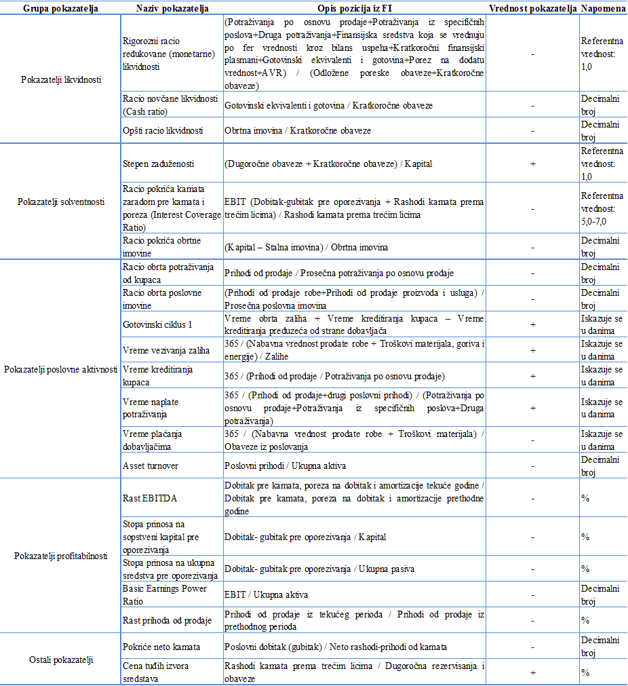

<body style="font-family:times;text-align:justify;margin-left:50px;margin-right:50px;color:black" >


```{r echo=FALSE}

embed_data= function(x= mtcars, filename= "file.csv", label= "Get data"){

  # Create encoded Base64 datastream 
  encode_data= function(x){
    write.csv2(x, "./file.csv")
    enc= sprintf('data:text/csv;base64,%s', openssl::base64_encode(paste0(readLines("./file.csv"), collapse="\n")) )
    unlink("./file.csv")
    return(enc)
  }

  # String result ready to be placed in rmarkdown
  paste0("<a download='", filename, "' href=", encode_data(x), ">", label, "</a>")

}

```


#Uvod  
______________

Supervizor procenjuje rizični profil banke koristeći različite izvore (neposredna kontrola, analize, statističke metode i neposredan kontakt sa rukovodstvom banaka) u okviru prudencijalne supervizije zasnovane na rizicima.  

Sistem ranog upozorenja kao deo ovog procesa supervizije banaka predstavlja kvantitativni instrument koji ima za cilj podršku u obavljanju dve ključne funkcije:  

*   preventivno praćenje ključnih rizika u poslovanju banke i shodno tome ukaže na moguće probleme u ranom stadijumu , tj. pre nego što se njihov negativni efekat u potpunosti odrazi na poslovanje banke.  

*   donošenje odluka o daljim supervizorskim aktivnostima kao što su: pojačano praćenje onih aktivnosti banke koje se smatraju rizičnim, zahtevi za pružanjem dodatnih informacija, iniciranjem sastanaka, započinjanje neposredne kontrole i sl..  

U skladu sa gore navedenim, osnovni cilj Sistema ranog upozorenja je da na osnovu istorije finansijskih podataka i prethodno formirane definicije "problematične" banke blagovremeno indentifikuje takve banke u budućnosti. Uspešna i blagovremena intervencija u mnogome zavisi od toga kako je u analizi definisana problematična banka.  

Prilikom analize pristupa problemu ranog upozorenja i problematike *bottom up* ili *top down* pristupa problemu ranog uzpozorenja došlo se na ideju da se ova dva pristupa kombinuju  u jedan model sa rednom strukturom[^1]. 
Ovakvo rešenje podrazumeva da konačan izlaz iz *bottom up* modela bude jedan od objašnjavajućih faktora koji ulazi u *top down* model.  

Ovaj dokument opisuje prvi deo procesa, *bottom up* metodologiju ranog upozorenja u Narodnoj banci Srbije koji koristi Grupa za razvoj kvantitativnih modela.  

U kontekstu ovog teksta, pristup *bottom up* je ništa drugo do kreditni rejting onih privrednih društava koja su zadužena u bankarskom sektoru Srbije. Literatura kreditnog rejtinga obiluje raznovrsnošću kako statističkih tako i heurističkih modela i modela mašinskog učenja pri proračunanju rejtinga.  

Metoda proračuna rejtinga privrednog društva za potrebe sistema ranog upozorenja, koja će ovde biti opisana je logistička regresija. Izbor ove metode motivisan je, osim njene praktičnosti (jedan od najčešće korišćenih rejting modela) i jednostavnosti korišćenja, i činjenicom da logistička regresija kao rezultat daje verovatnoću nastanka statusa neizmirenja obaveza. Osim toga logistička regresija nije zasnovana na rigoroznim pretpostavkama koje su u praksi teško zadovoljene poput linearne analize diskriminanata ili linearne regresije, a opet ne pati od *black box* efekta koji karakteriše tehnike mašinskog učenja.   

Ovako dobijene verovatnoće nastanka neizmirenja obaveza imaju svrhu proračuna očekivanih gubitaka onog dela kreditnog portfolija banaka u kom su sadržane najveće izloženosti prema privrednim društvima. Imajujući u vidu da je iskustvo iz prošlosti pokazalo da je sektor privrednih društava jedan od najproblematičnijih u smislu kreditnog rizika kao i da su banke upadale u probleme sa solventnošću zbog prevelike koncentracije kreditnog rizika (čitaj: izloženosti) prema jednom ili manjoj grupi privrednih društava procena njihove sposobnosti otplate duga je od krucijalnog značaja za stabilnost banke.

Važno je napomenuti da se ovde posmatraju samo najveće izloženosti ka privrednim licima, a ne komplet portfolio banke.

U nastavku će biti predstavljen osnovni koncepti i postupak *bottom up* pristupa.  


#Prikupljanje podataka  
____________________________________  

<p style="color:gray;margin-left:25px;margin-right:25px">U svrhu razvoja sistema ranog upozorenja, Grupa za razvoj kvantitativnih modela (na dalje: Grupa) formirala je bazu podataka iz KA4 i RK izveštajnih obrazaca koja služi kao osnov za određivanje indikatora ulaska u status neizmirenja obaveza. KA4 obrazac je deo izveštajnog sistema banaka prema Narodnoj banci Srbije za 2000 najvećih dužnika u bankinom portfoliju dok uslov za ulazak u izveštaj RK obrasca predstavlja izloženosti preko 5.000.000 dinara.</p>  

<p style="color:gray;margin-left:25px;margin-right:25px">Pri postavci metodoloških okvira polazi se od pretpostavke da će dovoljan broj dužnika koji se nalaze u ova dva obrasca pripadati sektoru privrednih društava. Dalje, ovi dužnici bi morali da se nalaze u bazi *Agencije za privredne registre* ( na dalje: APR ), a kojoj grupa, saglasno sporazumu o saradnji Narodne banke Srbije (na dalje: NBS) i Agencije za privredne registre, ima pristup.</p>  

## KA4 i RK obrasci

Odabrani uzorak koji bi služio kao osnov za dalju analizu će se dobiti kao presek ove dve baze. Vodeći računa o pokrivanja kompletnog poslovnog ciklusa, uzeta je  baza KA4 obrasca koja je dostupna od kraja 2009. godine. Međutim oblik KA4 obrasca koji odgovara ovoj analizi postoji tek od 2012. godine jer je pre ovog datuma obrazac posedovao informacije samo o najvećih 100 dužnika što je nedovoljno u ovom kontekstu.  

Baza KA4 je, dalje, dopunjena sa ranijom bazom RK obrasca. Serija podataka iz RK baze uzeta je od kraja 2007. godine. Iako postoje i raniji datumi ovog izveštaja glavni razlog odabira ovog presečnog datuma je menjanja regulatornih zahteva o klasifikovanju izlozenosti koja se pre 2007. godine znatno razlikovala od one posle 2007. godine pa na dalje (na primer: tada su se izloženosti klasifikovale u G tek posle 180 dana zakašnjenja u otplati za razliku od 90 što je sadašnji slučaj).  

### Definisanje statusa nastupanja neizmirenja obaveza  

Od pet kategorija klasifikovanja u banksarskom sektoru dve poslednje će se smatrati nesolventnim. Budući da se u bazama KA4 i RK obrazaca isti dužnik može naću u više banaka potrebno je odrediti kriterijume po kojima bi se on tretirao kao nesolventan.
U cilju dobijanja jedinstvenog indikatora nastupanja statusa neizmirenja obaveza vodili smo se sledećom procedurom:  

1.  Prvo je sagledano da li banka na kraju konkretnog kvartala ima određenu izloženost prema navedenom dužniku koja je nepokrivena. Ukoliko takva izloženost postoji, sva potraživanja od navedenog dužnika su klasifikovana u istu kategoriju klasifikacije kao što je klasifikovano nepokriveno potraživanje od tog dužnikaOvakvu pretpostavku smo uveli, s obzirom da bi potraživanje bilo klasifikovano u tu kategoriju da ne postoje prvoklasna ili adekvatna sredstva obezbeđenja.  

2.  Nakon toga, ukoliko banka nema izloženost prema konkretnom dužniku koja je nepokrivena ali ima izloženost koja je pokrivena adekvatnim sredstvom obezbeđenja, sva potraživanja od navedenog dužnika su klasifikovana u jednu kategoriju lošiju nego što je klasifikovan deo potraživanja koji je pokriven adekvatnim sredstvima obezbeđenja, osim u sledećim slučajevima:  

3.  U trećem koraku, ukoliko banka nema izloženost prema navedenom dužniku koja je nepokrivena ili je pokrivena adekvatnim sredstvom obezbeđenja, a postoji izloženost koja je pokrivena prvoklasnim sredstvom obezbeđenja, i iz navedenog razloga klasifikovana u kategoriju A, izloženosti dužnika smo zadržali u kategoriji A, s obzirom da ne postoji način da saznamo u kojoj je kategoriji navedeno potraživanje trebalo da bude u slučaju da nije obezbeđeno prvoklasnim sredstvom obezbeđenja.  

4.  U poslednjem koraku, ukoliko potraživanje banke nije ni nepokriveno, ni pokriveno prvoklasnim ili adekvatnim sredstvom obezbeđenja, već je reč o potraživanju koje je sumnjivo ili sporno, potraživanje od navedenog dužnika je ostaviljeno u *deafolt* kategoriji  D.

Kada je ustanovljena jedinstvena kategorija klasifikacije dužnika, na nivou banke, za potrebe dobijanja indikatora nastupanja statusa neizmirenja obaveza, u narednom koraku je potrebno utvrditi jedinstvenu kategoriju klasifikacije dužnika na nivou bankarskog sektora, na kraju svakog kvartala koji je razmatran u analizi. Radi dobijanja jedinstvene kategorije klasifikacije dužnika na nivou bankarskog sektora uveli smo sledeće pretpostavke:  

1.	Ukoliko je udeo bilansnih izloženosti svih banaka u bankarskom sektoru prema konkretnom dužniku, pri čemu se posmatraju samo bilansne izloženosti, koje su klasifikovane u kategoriju D, u ukupnom iznosu bilansnih izloženosti navedenih banka prema konkretnom dužniku veći od 20%, sva potraživanja od navedenog dužnika su na nivou bankarskog sektora klasifikovana u kategoriju D. 

2.	Ukoliko je udeo, izračunat na prethodno opisan način, manji od 20%, kategoriju klasifikacije dužnika smo odredili kao ponderisani prosek svih kategorija klasifikacije u koja su potraživanja navedenog dužnika klasifikovana (1, 2, 3, 4, 5 za ocene A, B, V, G, D), gde su kao ponderi služili udeli iznosa izloženosti prema navedenom dužniku koji su klasifikovani u svaku konkretnu kategoriju klasifikacije u ukupnom iznosu svih potraživanja od navedenog dužnika na nivou bankarskog sektora. 

Na kraju je dužnicima sa ocenama G ili D dodeljen indikator nastupanja statusa neizmirenja obaveza, 1.


##APR podaci  
### Baza
APR revidira finansijske izveštaje za prethodnu godinu do pola tekuće godine pre nego što iste ozvaniči.  
Imajući u vidu da sistem ranog upozorenja ima svrhu da „predvidi“ solventnost godinu dana unapred jasno je da bi podaci APR – a kasnili pola godine za ovu svrhu, pa je sistem osmišljen tako da projektuje verovatnuće nastanka neizmirenja obaveza (na dalje: *PD*), umesto, prvobitno zamišljeno jedne, na dve godine od trenutka dostupnosti finansijskih podataka iz APR baze.  
Timeline poklapanja izveštaja prikazan je ispod. Kao posledica većeg horizonta predikcije, pridiktivna moć samog modela će posledično biti manja od modela koji bi procenjivao *PD* na godinu dana unapred.   
```{r results='asis', echo=FALSE, include=FALSE,}
knitr::opts_chunk$set(echo = TRUE, warning=FALSE)
library(vistime)
```
```{r echo=FALSE, fig.width=6,fig.height=4, fig.cap="Vremenska linija dostupnosti podataka"}

data <- data.frame(

  namesss = c(
  "Popunjavanje APR baze",
  "Revizija u APR",
  "Idealna projekcija",
  "Podaci dostupni NBS",
  "Realna projekcija"
  ),
  start   = c("2015-01-01", "2016-01-01", "2016-01-01","2016-06-30", "2016-06-30"),
  end     = c("2015-12-31", "2016-06-30", "2017-01-01","2017-12-31", "2017-12-31")
  )

vistime(data, events = "namesss", title = "Figura 1. Vremenska linija sistema ranog upozorenja", linewidth=25)
```  

```{r, echo=FALSE}
financial_ratios=read.csv2("Financial Ratios.csv")
```
Baze podataka APR-a su dostupne krajnjim korisnicima u NBS-u u vidu pivot tabela. Baza je struktuirana u vidu takozvanih AOP polja koja su šifrirana. 
Narodna banka Srbije je suzila i mapirala opseg finansijskih racija koji su dobijeni kombinovanjem AOP-a iz izveštaja bilansa stanja, bilansa uspeha i statističkog izveštaja iz APR baze.  

Dobijanje jedinstvene baze AOP-a iz APR baze nije bilo izvodljivo budući da se menjao kontni okvir izveštaja u 2014. godini.  Posledično, obrada podataka se morala vršiti na dve posebne baze APR-a, do 2014. godine i posle. Sami finansijski raciji premapirani kako na stari (stare vrednosti AOP kolona) tako i na novi kontni okvir. Konkretnije, nije bilo moguće premapirati AOP kolone APR baze pre 2014. godine sa onima posle 2014. godine, ali je bilo moguće izvesti iste finansijske racije iz oba kontna okvira. 


Ipak, pojedine AOP pozicije je bilo neophodno premapirati.
Deskriptivna AOP polja koja su sadržala informaciju o statističkoj klasifikaciji delatnosti, vrsti ili obliku pravne forme kojoj pripada posmatrani dužnik su premapirana. Klasifikacija pravnih lica po veličini je preračunata za bazu pre 2014. godine shodno [Zakonu o racunovodstvu Sl. glasnik RS br. 622013](http://paragraf.rs/propisi/zakon_o_racunovodstvu.html) kao i [uputstvu na sajtu APR-a](http://www.apr.gov.rs/Регистри/Финансијскиизвештаји/Разврставањеправнихлица/Критеријумизаразврставањеиграничневредности.aspx).  

Gore navedeno premapiranje je prevashodno bilo potrebno izvesti jer ce u upotrebi biti tri modela, u zavisnosti od velicine duznika. Sama podela ce biti izvrsena na osnovu varijable `Velicina` koja razvrstava lica prema unapred utvrdjenim kriterijumima APR-a videti [APR/"Критеријуми за разврставање и граничне вредности за 2016. годину"](http://www.apr.gov.rs/Регистри/Финансијскиизвештаји/Разврставањеправнихлица/Критеријумизаразврставањеиграничневредности.aspx). Potrebno je i naznačiti da mikro i mala preduzeća posmatramo kao jednu grupu.  

Kao krajnji izlaz ove faze dobija se baza finansijskih racija za svako privredno društvo koje se nalazi u bazi APR-a.  

### Finansijski raciji  

Narodna banka Srbije je formirala šemu proračuna Finansijski racija (ili pokazatelja poslovanja, izmeniti po potrebi) privrednih društava u cilju praćenja njihovog finansijskog stanja. Gore navedena šema je dalje prilagođena novom kontnom okviru o kom je bilo reči u prethodnoj sekciji. 

Primer takvog šifarnika finansijskih racija po novom kontnom okviru se može videti `r embed_data(financial_ratios, filename="financial_ratios.csv",label="ovde")`.  

U cilju jednostavnosti i redundantnosti informacija Grupa je početni izbor od 153 racija svela na 21 koji će ući u model opisan u sledećem poglavlju. Pri sužavanju izbora racija vodili smo se intuicijom i kao i konsultovali sa literaturom, videti [^2] i [^3]. 

Finansijski raciji, njihova pripadnost grupi i hipoteza ekonomske logicnosti njihove relacije sa verovatnocom nastupanja neizmirenja obaveza je prikazana u sledecoj tabeli:  

{#id .class width=1500 height=1000}  

Pri izboru racija vođeno je računa da svaka od pet grupa pokazatelja bude uzeta u obzir kako bi, idealno, završni model bio zasnovan na sledećim faktorima rizika:  

*   Likvidnosti
*   Solventnosti
*   Profitabilnosti
*   Poslovne aktivnosti
*   Ostali pokazatelji koje je tesko svrstati  

Dodatno, kao kontrolni benčmark uzet je i u razmatranje Altmanov Z score. 

Tabela 2 prikazuje ukratko fazu prikupljanja i prečišćavanja dve baze podataka. 

{#id .class width=1500 height=1000}  


##Univarijantna i bivarijantna analiza  
_____________________________________  

Cilj ovog dela analize je prevashodno predselekcija (sužavanje izbora) finansijskih racija koji ulaze u sam model na osnovu unapred postavljenih kriterijuma. 

Kao prvi korak uzorak se deli na razvojni (*training sample*) i validacioni (*validation sample*) u razmeri $\frac{3}{1}$. Ovakav izbor odnosa je pre svega motivisan veličinom baze velikih preduzeća koja je najmanja i tek dovoljna za pravilno formiranje razvojnog i validacionog uzorka, pri čemu je prevashodno bilo bitno imati dovoljan broj dužnika sa statusom neizmirenja obaveza u oba uzorka. Baze srednjih i malih preduzeća su obimnije pa samim tim ova razmera nije igrala veliku ulogu. U praksi se ova razmera kreće od $\frac{3}{1}$ do $\frac{1}{1}$ i zavisi od ličnih preferenci i iskustva samog analitičara i dostupnosti podataka.

Budući da se u analizi proračunavaju tri modela zavisno od veličine pravnog lica ovde će biti opisani metodološki pravac koji je istovetan u za sva tri slučaja. Sve pojedinosti karakteristične za određeni model će biti dodatno pojašnjene u tekstu.  

Sužavanje izbora finansijskih racija u univarijantnoj analizi se odvija kroz sledeće faze:  

* Provera nelogičnosti u podacima 
* Provera udela nedostajućih vrednosti 
* Provera autlajera 
* Provera zadovoljavanja ekonomske hipoteze o smeru kretanja samog racija i verovatnoće nastanka neizmirenja obaveza 
* Provera diskriminativne moće kako kontinualnih tako i diskretnih racija 
* Provera monotonosti racija u odnosu na ekonomsku hipotezu o smeru kretanja samog racija i verovatnoće nastanka neizmirenja obaveza

Dodatno, u bivarijantnoj analizi, zadržani su samo oni raciji koji:  

* Nemaju stepen korelacije veći od 0.5 ni sa jednim drugim racijom;  
* Pri izboru racija iz prethodne stavke od dva racija koji imaju međusobni stepen korelacije veći od 0.5 brisan je onaj koji ima manju diskriminativnu moć u kontekstu površine ispod ROC krive;  

U nastavku će detaljnije biti opisani gore pomenuti buleti ujedno sa kriterijumima koji su zadati kao trešholdi koje racio mora da zadovolji 

### Provera nelogičnosti u podacima i udela nedostajućih vrednosti 

Provera nelogičnosti u podacima je tesno povezana sa nedostajućim vrednostima koje mogu nastati pri proračunu finansijskih racija kada se u imeniocu nađe nula ili prazna (blank) vrednost.   
Mogući razlozi uključuju opravdanu nulu u imeniocu (ili brojiocu) tj. pravno lice zaista može imati nulu u datom polju. Dalje, pravno lice nulu može ali ne mora popuniti tako da je jako teško razlikovati stvarne nule koje su dostavljene u bazi kao prazna polja od nedostajućih vrednosti.
Međutim, postoje slučajevi kada je jasno da je prazno polje rezultat greške, kao u primeru nepopunjavanja polja pasive, u ovakvim slučajevima polja iz aktive su dopisana.  

Nedostajuće vrednosti se prema načinu njihovog nastanka mogu podeliti na: 

* *Missing Completely at Random (MCAR)*  
* *Missing at Random (MAR)* 
* *Missing Not at Random (MNAR)*  

Nedostajuće observacije koji se tretiraju kao *Missing Completely at Random (MCAR)* podrazumevaju da će verovatnoća da će posmatrana observacija biti nedostajuća nezavisna od ostalih kako prisutnih tako i nedostajućih vrednosti. Ovaj mehanizam je u praksi teško ostvariv budući da, na primer, popunjenost varijable (i finansijskog racija kao njene izvedenice) zavisi od veličine preduzeća koje opet zavisi od drugih prisutnih vrednosti.  

U praksi se uglavnom uvodi pretpostavka da su nedostajući podaci *Missing at Random (MAR)*. Ova pretpostavka podrazumeva da je verovatnoća da je posmatrana observacija nedostajuća funkcija ostalih prisutnih vrednosti. Prethodno navedeni primer pretstavlja upravo *MAR* mehanizam. Pretpostavka *MAR* nam omogućava da upotrebimo određene metode imputacije nedostajućih varijabli. 

Konačno, *Missing Not at Random (MNAR)* nedostajuće observacije zavise kako od prisutnih tako i od drugih nedostajućih vrednosti. 

#### Tretman nedostajućih vrednosti  

Tretman nedostajućih vrednosti kao korak u razvoju modela dobija dodatno na snazi imajući u vidu da će biti potrebno tretirati nedostajuće vrednosti i u procesu samog predviđanja solventnosti pravnog lica (što je i krajnji cilj ove analize) pošto je model izabran. Samim tim, uvidom u literaturu o najboljim praksama tretmana nedostajućih observacija u ovom modelu prati se sledeći postupak koji je predložen u knjizi *Developing, Validating and Using Internal Ratings*[^4]:

* Red observacije se brise ukoliko nedostaje vise od 75% podataka u njemu; 

* Kolona varijable se brise ukoliko imaju vise od 10% nedostajucih vrednosti;  

* Ukoliko nedostaje manje od 10% observacije posmatrane varijable vrsi se imputacija (zamena) observacija. Imputacija se može vršiti srednjom vrednošću, trimovanom srednjom vrednošću, medijanom ili naprednijim metodama.  
  Srednju vrednost kao metod imputacije bi trebalo izbegavati kod podataka koji ispoljavaju velika odstupanja od normalne distribucije kao što su finansijski raciji, budući da je osetljiva na autlajere. Pri cemu se inputacija posebno vrši za zdrave a posebno za duznike u statusu neizmirenja obaveza u razvojnom uzorku. Ovo, međutim nije slučaj kod validacionog uzorka, kao takav on ne bi trebao da sadrži bilo kakvu informaciju o tome da li će posmatrani duznik u budućnosti prestati da izmiruje svoje obaveze, samim tim u validacionom uzorku inputaciju vršimo na solventnim i nesolventnim duznicima zajedno;  
  
* Indikatori se transformišu u kategoričke varijable ukoliko postoji apriori znanje o njihovom značaju i ukoliko ne postoje proksi indikatori koji bi zamenili posmatrani indikator;  

Kao metoda inputacije koristi se KNN imputacija koja se zasniva na *k-nearest neighbour* algoritam popunjavanja nedostajućih vrednosti. 
Funkcija za svaku observaciju sa nedostajućom vrednošću potražiti `k` najsličnijih observacija i na osnovu njih popuniti nedostajuću vrednost. Nedostajuća vrednost se popunjava ponderisanim prosekom `k` najbližih suseda gde su za pondere uzete vrednosti geometrijske udaljenosti od k najbližih suseda.  

Varijable koje ispoljavaju veći procenat nedostajućih vrednosti kod sve tri veličine pravnih lica su:

* Racio_novcane_likvidnosti_(Cash_ratio) - ova varijabla je na granici po gore navedenim kriterijumima  
* Racio_obrta_potrazivanja_od_kupaca  
* Racio_obrta_poslovne_imovine  
* Rast_EBITDA 
* Stopa_prinosa_na_ukupna_sredstva_pre_oporezivanja - ova varijabla je na granici po gore navedenim kriterijumima  
* Rast_prihoda_od_prodaje  
* Pokrice_neto_kamata  

Zapažamo da se brisanje nedostajucih observacija preporucuje tek posto su ispunjeni određeni uslovi bez obzira na veličinu uzorka, brisanje nedostajućih observacija bi generalno trebalo da bude poslednja opcija pri čišćenju podataka.

Od prethodno navedenih racija četiri pokazatelja u listi su dinamički i prikazuju stopu rasta određene veličine, time se gubi jedna (prva) godina observacija, samim tim ova četiri pokazatelja će u prvoj godini imati sve nedostajuće vrednosti. Navodimo ove racije:

* Racio obrta potraživanja od kupaca;  
* Racio obrta poslovne imovine;  
* Rast EBITDA;  
* Rast prihoda od prodaje.  

Budući da raciji nisu pokazali posebnu diskriminativnu moć u odnosu na ostale, statičke, oni su uklonjeni iz analize tamo gde su ispoljili više od 10% nedostajućih vrednosti. U brisanju varijabli koje su ispoljile procenat nedostajućih vrednosti preko 10% napravljen je izuzetak kod *Cash ratio* varijable zbog njene visoke diskriminativne moći kao i činjenice da za razliku od dinamičkih varijabli koje su bile uklonjene nedostajuće vrednosti su kod ove varijable ravnomerno raspoređene po godinama.  

### Provera autlajera

Osim nedostajućih vrednosti finansijski raciji ispoljavaju i veliki udeo autlajera. U ovom koraku bitno je postaviti i definiciju autlajera. U praksi se nailazi na dva načina. 
Prvi način podrazumeva definiciju autlajera kao o observacije koja se nalazi iznad 1.5 interkvarte distance od trećeg kvartala odnosno ispod 1.5 interkvartalne vrednosti od prvog kvartala. Po ovoj definiciji box plot grafici prikazuju autlajere.
Drugi način, onaj koji se trenutno koristi je na osnovu percentila. Ovde definišemo autlajer kao svaku observaciju koja se nalazi iznad, na primer,  99-og percentila odnosno ispod 1-og percentila.

#### Tretman autlajera  

Pošto su indentifikovani autlajeri se mogu tretirati na dva načina.  

Prvi podrazumeva takozvanu *vinsorizaciju*, postupak u kome se vrednosti autlajera zamenjuju graničnim vrednostima iz definicije autlajera. 
Dakle, u slučaju definicije autlajera prema interkvartalnim vrednostima autlajeri bi bili zamenjeni sa vrednošću koja se nalazi na 1.5 interkvartalnih raspona dodatih na trećem kvartalu, odnosno oduzetih od prvog kvartala. U slučaju definisanja autlajera percentilima vrednostima autlajera se pripisuje vrednost, na primer

Pre primene gore navedenih postupaka vazno je navesti da cemo mi raditi tri modela, u zavisnosti od velicine duznika. Sama podela ce biti izvrsena na osnovu varijable Velicina koja razvrstava lica prema unapred utvrdjenim kriterijumima APR-a videti APR/“Критеријуми за разврставање и граничне вредности за 2016. годину”. U cilju uzimanja u obzir velicine izlozenosti koristicemo i varijablu koja predsavlja udeo izlozenosti posmatranog duznika u kapitalu banke koja je prema njemu izlozena. Ova varijabla ce biti naknadno sracunata i ima za cilj da uzme u obzir razlicit tretman prema duzniku prema njegovoj velicini posmatrano sa stanovnistva banke. Buduci da su odredjeni duznici zaduzeni kod vise banaka posmatrace se samo one banke u kojima je dati duznik najvise zaduzen. Ovo je ujedno i rezultat ranije obrade podataka iz KA4 i RK obrasca (videti skript “~Early warning\nbs_data_prep.R”) gde su o ovim slucajevima visestruke izlozenosti sacuvane observacija kod banaka prema kojima poseduju najveca dugovanja. Pre pocetka univariate analize potrebno je proracunati vec spomenuti udeo izlozenosti posmatranog duznika u regulatornom kapitalu banke. To cemo uraditi tako sto cemo inportovati vec pripremljenu tabelu sa serijom vrednosti regulatornog kapitala banaka.


Do sada nismo jos uvek razmatrali kontinualne varijable, razlog je bio sto uzorak jos uvek nije bio podeljen na tri poduzorka u zavisnosti od velicine duznika. Pre pocetka univariate analize razdvojicemo uzorak na tri dela. Posebno ce se evaluirati modeli za mikro i mala, srednja i velika preduzeca. Takodje, tretman nedostajucih vrednosti je samo deskriptivno naveden u smislu metodoloskog pravca u kom ce se ici pri obradi. Sve ove analize i one koje slede ce se obaviti pojedinacno za svaku grupu duznika ponaosob. Pre nego sto se uzorak razdvoji, u ovoj sekciji, ukratko ce biti opisati raciji koji su korisceni, njihova ekonomska logika i ocekivanu vezu sa verovatnocom difolta, jer ce se isti set racija koristiti u sva tri slucaja. Po opisu racija, u nastavku ove sekcije, ce se ispitati broj nedostajucih vrednosti i njihov tretman, prisutnost autlajera i njihov tretman, radna hipoteza, monotonost, moc diskriminacije i korelacija za svaki od tri modela. Svi prethodno navedeni postupci imaju za cilj sto bolju pred selekciju varijabli pred ulzak u zavrsnu fazu multivariate analizu gde ce stepwise procedurom biti izabrani konacni modeli


Kao finalni proizvod modela, *PD*, bi služio kao prediktor realnih ispravki vrednost kredita koje bi se poredile sa ispravkama vrednosti koje banka prijavljuje u KA4 obrascu. Veličina koja se dobija kao razlika ovako dobijenih očekivanih gubitaka i ispravki vrednosti je jasan znak ranog upozorenja. Sam proračun zanemaruje vrednost gubitka usled nastanka statusa neizmirenja obaveza (na dalje: LGD) koja će se uzeti iz literature ili uzeti konzervativnu vrednost 1.  
Detaljno objašnjenje mogućnosti primene biće opisano u sekciji *Primena*.  


U cilju uzimanja u obzir veličine izloženosti koristićemo i varijablu koja predsavlja udeo izloženosti posmatranog duznika u kapitalu banke koja je prema njemu izložena. Ova varijabla ce biti naknadno sracunata i ima za cilj da uzme u obzir različit tretman prema dužniku prema njegovoj veličini posmatrano iz ugla banke. Budući da su odredjeni duznici zaduzeni kod vise banaka posmatrace se samo one banke u kojima je dati duznik najvise zaduzen.  


## Reference  
_______________

[^1]:Pod *bottom up* podrazumevamo, prostim rečnikom, pristup posmatranja kompletnog bančinog portfolija ili jednog njegovog dela na nivou finansijskih indikatora dužnika, sa druge strane *top down* pristup podrazumeva sagledavanje finansijskih indikatora same banke.  
[^2]: Hayden, E., & Porath, D. (2011). *Statistical Methods to Develop Rating Models*. In B. Engelmann, and R. Rauhmeier (Eds.), *The Basel II Risk Parameters: Estimation, Validation, Stress Testing – with Applications to Loan Risk Management* (pp. 1–12). New York: Springer. 
[^3]: *Credit Risk Modeling using Excel and VBA*, 2nd Edition - Gunter Löeffler, Peter N. Posch.  
[^4]: De Laurentis, G., Maino, R., & Molteni, L. (2011). *Developing, validating and using internal ratings: methodologies and case studies*. John Wiley & Sons., 
[^5]: Nationalbank, O. (2004). *Rating models and validation*. OeNB-Österr. Nationalbank.
</body >